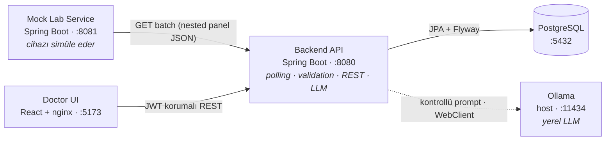

# Lab Results Smart Assistant

Sistem, bir laboratuvar cihazını periyodik olarak dinleyerek gelen test sonuçlarını doğrular,
veritabanına kaydeder, anormal değerleri işaretler ve yerel bir LLM aracılığıyla doktora ön
değerlendirme sunar. Doktorlar React tabanlı arayüz üzerinden giriş yaparak hastalarını, tüplerini
ve test panellerini görüntüleyebilir.

Çoğu demo yalnızca "happy path" senaryolarına odaklanırken, bu projede hata senaryoları da görünür
ve test edilebilir şekilde ele alınmıştır. Bozuk veri, duplicate mesajlar, cihaz bağlantı
kesintileri, LLM timeout'ları ve hatalı model çıktıları gibi durumlarda sistemin nasıl davranacağı
açıkça tanımlanmış; bu davranışlar hem dokümantasyon hem de otomatik testlerle güvence altına
alınmıştır.

> Bu bir teknik değerlendirme projesidir. **Gerçek hasta verisi yoktur; tüm veriler mock/demodur.**
> AI çıktısı bir tanı değil, doktora yönelik kontrollü bir ön değerlendirmedir.

[](https://github.com/dselimozcelik/lab-results-smart-assistant/actions/workflows/ci.yml)

---

## İçindekiler

- [5 Dakikada Çalıştır](#5-dakikada-çalıştır)
- [Yerel LLM ve Kaynak Gereksinimi](#yerel-llm-ve-kaynak-gereksinimi)
- [Mimari](#mimari)
- [Domain Modeli: Hasta → Tüp → Test](#domain-modeli-hasta--tüp--test)
- [Öne Çıkan Mühendislik Kararları](#öne-çıkan-mühendislik-kararları)
- [İş Kuralları](#i̇ş-kuralları)
- [Bilinçli Olarak Yapılmayanlar](#bilinçli-olarak-yapılmayanlar)
- [API Yüzeyi](#api-yüzeyi)
- [Test ve Kalite](#test-ve-kalite)
- [Teknoloji Seçimleri](#teknoloji-seçimleri)
- [Doküman İndeksi](#doküman-i̇ndeksi)

---

## 5 Dakikada Çalıştır

**Gereksinim:** [Git](https://git-scm.com/downloads),
[Docker Desktop](https://docs.docker.com/get-started/introduction/get-docker-desktop/) ve host
makinede [Ollama](https://ollama.com/download). AI ön analizi sistemin çekirdek özelliklerinden
biridir; modeli önceden indirmek demoyu eksiksiz gösterir.

```bash
# Repoyu indir
git clone https://github.com/dselimozcelik/lab-results-smart-assistant.git
cd lab-results-smart-assistant

# AI ön analizi modeli (sistemin temel bir parçası)
ollama pull gemma2:9b

# Her kurulum için özel JWT imzalama anahtarı üret
export JWT_SECRET="$(openssl rand -base64 48)"

# Tüm sistemi tek komutla ayağa kaldır
docker compose -f docker-compose.full.yml up --build
```

Backend hazır olduğunda:

```bash
curl http://localhost:8080/actuator/health   # {"status":"UP"}
```

Arayüz: **http://localhost:5173**

```text
Kullanıcı adı: doctor
Şifre:         Doctor123!
```

> Docker, dört bileşeni (PostgreSQL, mock cihaz, backend, frontend) tek komutla ayağa kaldırır;
> kuran kişinin makinesine Java, Node veya PostgreSQL kurması gerekmez. Adım adım kurulum, lokal
> geliştirme yöntemi ve sorun giderme için → [Kurulum ve Demo Kılavuzu](docs/kurulum-ve-demo.md).
> `JWT_SECRET` zorunludur; public bir varsayılan yoktur. Değer eksikse Compose başlamaz, 32
> karakterden kısaysa backend güvenli biçimde startup sırasında durur.
>
> **Windows:** Docker Desktop'ı WSL 2 backend ve Linux containers ile çalıştırın. Ollama Windows
> uygulaması arka planda `localhost:11434` üzerinde çalışır; compose içindeki backend ona
> `host.docker.internal` üzerinden ulaşır. PowerShell için güvenli `JWT_SECRET` üretme komutu kurulum
> kılavuzunda yer alır.

---

## Yerel LLM ve Kaynak Gereksinimi

LLM yorumu projenin opsiyonel bir eklentisi değildir; doktorun anormal sonuçları daha hızlı
değerlendirmesine yardımcı olan temel özelliklerden biridir. AI olmadan uygulama teknik olarak
çalışır ama amaçlanan deneyim eksik kalır. LLM, ayrı çalışan Ollama servisine ve makinenin belleğine
bağlıdır. Ollama geçici olarak erişilemese ya da model kaynak yetersizliğinden çalışamasa bile,
sonuçların cihazdan alınması, doğrulanması, saklanması ve doktor ekranında gösterilmesi durmamalıdır.

Bu yüzden sistem graceful degradation uyguluyor: AI yorumu istenemediğinde o istek kontrollü bir
`503 AI analysis unavailable` cevabı alır, sistemin geri kalanı çalışmaya devam eder. Amaç, tek bir
bileşendeki arızanın bütün hastane veri akışını çökertmesini engellemektir.

Varsayılan model `gemma2:9b`. Bu model, denenen daha küçük alternatiflere göre Türkçe akıcılığı ve
verilen anomali durumlarını yorumlama tutarlılığı daha iyi olduğu için seçildi. Model yerel
çalıştığından hasta verisi makineden çıkmıyor; karşılığında donanım ihtiyacı kuran kişinin makinesine
ait:

- `gemma2:9b` için en az 16 GB sistem belleği önerilir. Daha düşük bellekte yanıtlar belirgin şekilde
  yavaşlayabilir ya da model hiç çalışmayabilir.
- Model adı kodda sabit değil. Full Docker kurulumunda `OLLAMA_MODEL`, lokal geliştirmede
  `lab.ollama.model` ayarıyla kod değiştirmeden başka bir Ollama modeli seçilebilir.
- Daha küçük bir model kaynak ihtiyacını azaltır ama özellikle Türkçe anlatımda ve yorum
  tutarlılığında kalite düşürebilir. Model değiştirilirse aynı prompt senaryolarıyla yeniden
  değerlendirmek gerekir.
- Timeout, bağlantı hatası ve bozuk model çıktısı kontrollü biçimde reddedilir; hatalı analiz cache'e
  yazılmaz. Otomatik testler bu davranışı gerçek Ollama olmadan MockWebServer ile doğrular.

```bash
# Daha düşük kaynaklı bir modeli full Docker kurulumunda kullanma örneği
ollama pull qwen2.5:7b
OLLAMA_MODEL=qwen2.5:7b docker compose -f docker-compose.full.yml up --build
```

Yenileme aralığı `POLLING_DELAY_MS` ile dışarıdan ayarlanır; tek değişken hem backend polling'ini
hem frontend yenilemesini (refetch) birlikte değiştirir, varsayılan 30 sn (`30000`). Frontend değeri
Vite build argümanı olarak gömüldüğünden image yeniden build edilir:

```bash
# Hem backend polling hem frontend yenileme 15 sn olur
POLLING_DELAY_MS=15000 docker compose -f docker-compose.full.yml up --build
```

Model karşılaştırmasının gözlemleri ve seçim gerekçesi →
[AI Prompt Deney Günlüğü](docs/ai-prompt-experiments.md). LLM güvenlik sınırlarının teknik ayrıntıları →
[Teknik Tasarım — LLM Tasarımı](docs/teknik-tasarim.md#llm-tasarımı-ve-güvenlik-sınırları).

---

## Mimari

Sistem dört parçadan oluşur, her biri tek bir işten sorumlu. Ayrı ayrı çalıştırılabilirler.



Uçtan uca veri akışının ayrıntısı ve her adımın hangi kararı kanıtladığı:
→ [Teknik Tasarım — Uçtan Uca Akış](docs/teknik-tasarim.md#uçtan-uca-veri-akışı).

---

## Domain Modeli: Hasta → Tüp → Test

Projedeki en önemli karar buydu. İlk bakışta "her test bir kayıt" daha basit görünüyor. Ama gerçek
bir lab analizörü bir tüpü (sample) işler ve bir panel üretir: tek hasta, tek `sampleId`, tek ölçüm
zamanı, birden çok test. Model buna göre üç seviyeye bölündü:

```text
Patient            (API tarafında hasta bazında rollup)
  └─ Sample/Tube   (sampleId · patientId · measuredAt · deviceId)
       └─ LabResult[]   (testCode · value · unit · referans · anomalyStatus)
```

Bu modelin getirileri:

- `sampleId` doğal bir idempotency anahtarı oluyor.
- Aynı tüpteki testler birlikte görünüyor, böylece AI tek bir değeri değil panelin tamamını yorumluyor.
- Tüpün metadata'sı güvenilmezse tüm panel reddedilebilir. Tek bir test bozuksa yalnızca o test
  `INVALID` olur. Bunlar farklı durumlar ve ayrı ele alınıyor.

Gerekçenin tamamı ve reddedilen alternatif:
→ [Teknik Tasarım — Domain Modeli](docs/teknik-tasarim.md#domain-modeli-hasta--tüp--test).

---

## Mühendislik kararları

Her kararın bir cümlelik özü aşağıdadır. Gerekçesi, alternatifi ve production karşılığı teknik
tasarım belgesindedir.

| Karar | Neden (özet) |
|---|---|
| **`@Scheduled(fixedDelay)`** ile polling | Yavaş bir cycle bitmeden yenisi başlamasın; üst üste binen ingestion olmasın. |
| Bozuk test **silinmez, `INVALID` saklanır** | "Test hiç gelmedi" ile "geldi ama kullanılamaz" doktor için farklı bilgidir. |
| Anomali **LLM'e değil, deterministic Java'ya** | Aynı girdi aynı sonucu verir, iş kuralı test edilebilir kalır ve model halüsinasyonu durumu değiştiremez. |
| LLM çıktısına **kısmen** güvenilir | `flaggedTests` ve disclaimer backend'den gelir; model yalnızca verilen gerçekleri yorumlar. |
| Token **memory'de**, localStorage'da değil | Sağlık verisi demosunda daha dar saldırı yüzeyi tercih edildi. |
| JWT secret **zorunlu ve repo dışında** | Public bir imzalama anahtarı login'i bypass edilebilir hale getirir; eksik/kısa secret ile sistem fail-fast olur. |
| `open-in-view: false` | Lazy-loading kaynaklı gizli N+1 ve açık-Session anti-pattern'i kapatıldı. |
| Entity değil **DTO** döndürülür | API sözleşmesi DB şemasından ayrı; iç alanlar sızmaz; `PageResponse` stabil pagination verir. |

### Güvenlik retrospektifi: hardcoded JWT secret

İlk geliştirme sürümünde, kurulumu kolaylaştırmak için dev ve Docker konfigürasyonunda tahmin edilebilir
bir JWT imzalama anahtarı varsayılan olarak bulunuyordu. Bu ciddi bir güvenlik hatasıydı: repo public
olduğu için anahtarı bilen biri parola kontrolünü tamamen atlayıp kendi imzalı `DOCTOR` token'ını
üretebilirdi. BCrypt parolayı doğru saklasa bile public JWT anahtarı bütün login korumasını etkisiz
hale getirirdi.

Bu nedenle public/default anahtar kaldırıldı. Sistem artık `JWT_SECRET` değerini runtime environment
variable olarak zorunlu ister; değer yoksa veya 32 karakterden kısaysa başlamaz. Lokal demo sırasında
her kurulum için rastgele anahtar şu komutla üretilir:

```bash
export JWT_SECRET="$(openssl rand -base64 48)"
```

Bu yöntem anahtarı kaynak koddan ve container image'dan uzak tutar; ancak environment variable tek
başına production secret manager değildir. Production'da Vault, AWS Secrets Manager veya platform
secret store üzerinden injection, erişim denetimi ve kontrollü key rotation kullanılırdı. Eski anahtar
bir kez git geçmişine girdiyse yalnız koddan silmek yeterli değildir; aktif deployment anahtarları
rotate edilmeli ve gerekirse git geçmişi temizlenmelidir.

Detay → [Teknik Tasarım](docs/teknik-tasarim.md).

---

## İş Kuralları

Anomali durumu beş değerden biri ve konfigüre edilebilir bir eşikle hesaplanıyor:

| Durum | Kural |
|---|---|
| `NORMAL` | `min ≤ value ≤ max` |
| `LOW` | `value < min` |
| `HIGH` | `value > max` |
| `CRITICAL` | Değer, sınırı aralık genişliğinin `factor` katından fazla aşıyor (varsayılan `factor = 0.5`) |
| `INVALID` | Eksik veya sonlu olmayan (`NaN`/Infinity) değer, bilinmeyen birim, `min > max`, eksik sınır ya da gelecek/çok eski ölçüm |

```text
CRITICAL eşiği:
  value < min − factor·(max − min)   veya   value > max + factor·(max − min)
```

> Bu açıklanabilir bir demo heuristiği, klinik gerçek değil. Production'da test bazlı, klinisyen
> onaylı panic value'lar (versiyonlu bir config servisinden) kullanılırdı. Eşik `application-*.yml`
> içindeki `lab.anomaly.critical-factor` ile dışarıdan yönetiliyor, kodda sabit bir sayı yok.

---

## Bilinçli Olarak Yapılmayanlar

Bu tek node'luk bir değerlendirme demosudur, production-ready olma iddiası yoktur. Aşağıdakiler
bilerek kapsam dışı bırakıldı. Her birinin nedeni ve production karşılığı vardır:

| Konu | Bu kapsamda neden yok? | Production yaklaşımı |
|---|---|---|
| Senkron LLM çağrısı | Demo akışını sade ve izlenebilir tutmak | Queue + worker + job-status |
| Tek global kritik faktör | Açıklanabilir demo kuralı yeterli | Test bazlı klinik panik değerleri |
| Tek `DOCTOR` rolü | Proje kapsamında ek rol gerekmiyor | Identity provider + RBAC |
| Flyway ile sabit demo doktor | Reviewer ek provisioning yapmadan login akışını doğrulayabilsin | Demo seed yok; IdP/admin provisioning + geçici credential + rate-limit/lockout |
| Memory'de JWT | Token'ı tarayıcı storage'ında bırakmamak | BFF veya güvenli HttpOnly cookie/session |
| Tek-instance scheduler | Multi-instance açıkça kapsam dışı | ShedLock / distributed scheduler |
| HTTP (localhost) | Lokal demo | TLS + secret manager + network policy |
| WebSocket / realtime | 30 sn'lik periyodik yenileme demo için yeterli | Event-driven push |
| Refresh token rotation, multi-model LLM, Kubernetes | Açıkça kapsam dışı | İhtiyaca göre eklenir |

---

## API Yüzeyi

JWT korumalı uçlar (tamamı `Pageable` listeler `page/size/sort` parametreleriyle):

```text
POST /api/auth/login                                  → JWT döner
GET  /api/patients                                    → hasta rollup listesi (filtre + pagination)
GET  /api/patients/suggestions?query=p-               → case-insensitive autocomplete
GET  /api/patients/{patientId}                        → hastanın tüpleri + test panelleri
GET  /api/patients/{patientId}/tests/{testCode}/history → tek testin zaman serisi (trend grafiği)
POST /api/samples/{sampleId}/ai-analysis              → tüp/panel seviyesinde AI ön analizi
GET  /api/audit-logs                                  → polling cycle kayıtları
```

Mock cihaz, hata yollarını test etmek için kontrollü senaryolar sunar:

```text
GET /api/device-results/batch?scenario=
    normal | abnormal | critical | duplicate | missing-field | invalid-unit | stale | device-error
```

İnteraktif dokümantasyon (Swagger UI, JWT bearer ve pageable parametreleri çalıştırılabilir):
**http://localhost:8080/swagger-ui/index.html**

---

## Test ve Kalite

```bash
cd backend-api && ./mvnw test                                  # 54 test
cd mock-lab-service && ./mvnw test                             # 10 test
cd frontend && npm ci && npm test && npm run lint && npm run build   # 14 test
```

- Backend integration testleri gerçek PostgreSQL'i Testcontainers ile başlatır. Flyway,
  unique constraint'ler ve PostgreSQL'e özgü sorgular H2 gibi başka bir motorda taklit edilmiyor.
- Mock cihaz ve Ollama testlerde MockWebServer ile izole edilir. Test paketi çalışmak için gerçek
  Ollama'ya veya ayakta bir mock servise ihtiyaç duymaz.
- AI isteğinde nginx timeout'u backend'in Ollama timeout'undan daha uzundur; model erişilemezse
  proxy'nin ham `504` cevabı yerine backend'in kontrollü hata cevabı UI'a ulaşır.
- Frontend testleri kullanıcı davranışını (login, kritik badge, arama, AI durumları) Testing Library
  ile doğrular.
- Her push ve PR'da [GitHub Actions CI](https://github.com/dselimozcelik/lab-results-smart-assistant/actions/workflows/ci.yml)
  üç bağımsız job (backend / mock / frontend) çalıştırır.

Test stratejisi, failure-mode matrisi ve her senaryonun hangi testle kanıtlandığı:
→ [Teknik Tasarım — Test Stratejisi](docs/teknik-tasarim.md#test-stratejisi-ve-failure-mode-matrisi).

---

## Teknoloji Seçimleri

| Katman | Seçim | Neden bu? |
|---|---|---|
| Backend | Spring Boot 3.3.5 · Java 17 | Olgun ekosistem; Security/Data/Validation tek çatı altında. |
| DB erişimi | Spring Data JPA + **Flyway** | Şema versiyonlu ve tekrarlanabilir; `ddl-auto: validate` ile entity↔şema uyumu boot'ta doğrulanır. |
| Auth | Spring Security + JWT + BCrypt | Stateless API'ye uygun; BCrypt tek yönlü hash (salt'ı kendinde taşır). |
| LLM | Ollama + **raw WebClient** | Tek provider/endpoint için Spring AI gibi büyük bir abstraction gereksizdi. |
| Frontend | React 19 · TS 6 · Vite 8 · **TanStack Query 5** | Sunucu durumu (cache, retry, keepPreviousData) için elle state yönetiminden daha sağlam. |

Alternatiflerin değerlendirmesi → [Teknik Tasarım](docs/teknik-tasarim.md).

---

## Doküman İndeksi

| Belge | İçerik |
|---|---|
| [Kurulum ve Demo Kılavuzu](docs/kurulum-ve-demo.md) | Docker/lokal kurulum, adım adım görselli demo akışı, mock senaryoları, API curl'leri, sorun giderme |
| [Teknik Tasarım ve Karar Savunması](docs/teknik-tasarim.md) | Mimari, domain modeli, her kararın gerekçe/alternatif/production karşılığı, LLM güvenlik sınırları, test stratejisi |
