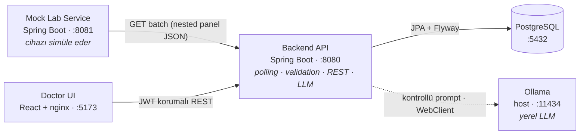

# Lab Results Smart Assistant

Bir laboratuvar cihazını periyodik olarak dinleyen; gelen test sonuçlarını doğrulayan, saklayan ve
anomalilerini sınıflandıran; doktora yerel bir LLM ile **ön değerlendirme** sunan full-stack bir
sistem. Doktorlar React arayüzünden giriş yapıp hastalarını, tüplerini ve test panellerini inceler.

Bu projeyi "çalışan bir demo" olarak değil, **hata yollarının da görünür ve test edilebilir olduğu**
küçük ama sağlam bir sistem olarak tasarladım: bozuk veri, duplicate mesaj, cihaz kesintisi, LLM
timeout'u ve hatalı model çıktısı gibi durumlarda sistemin ne yaptığı dokümante ve otomatik testlerle
kanıtlanmıştır.

> Bu bir teknik değerlendirme projesidir. **Gerçek hasta verisi yoktur; tüm veriler mock/demodur.**
> AI çıktısı bir tanı değil, doktora yönelik kontrollü bir ön değerlendirmedir.

[](https://github.com/dselimozcelik/lab-results-smart-assistant/actions/workflows/ci.yml)

---

## İçindekiler

- [5 Dakikada Çalıştır](#5-dakikada-çalıştır)
- [Mimari](#mimari)
- [Domain Modeli: Hasta → Tüp → Test](#domain-modeli-hasta--tüp--test)
- [Öne Çıkan Mühendislik Kararları](#öne-çıkan-mühendislik-kararları)
- [İş Kuralları](#i̇ş-kuralları)
- [Bilinçli Olarak Yapılmayanlar](#bilinçli-olarak-yapılmayanlar)
- [API Yüzeyi](#api-yüzeyi)
- [Test ve Kalite](#test-ve-kalite)
- [Teknoloji Seçimleri](#teknoloji-seçimleri)
- [Doküman İndeksi](#doküman-i̇ndeksi)

---

## 5 Dakikada Çalıştır

**Gereksinim:** [Git](https://git-scm.com/downloads),
[Docker Desktop](https://docs.docker.com/get-started/introduction/get-docker-desktop/) ve host
makinede [Ollama](https://ollama.com/download). AI ön analizi sistemin çekirdek özelliklerinden
biridir; modeli önceden indirmek demoyu eksiksiz gösterir.

```bash
# Repoyu indir
git clone https://github.com/dselimozcelik/lab-results-smart-assistant.git
cd lab-results-smart-assistant

# AI ön analizi modeli (sistemin temel bir parçası)
ollama pull gemma2:9b

# Tüm sistemi tek komutla ayağa kaldır
docker compose -f docker-compose.full.yml up --build
```

Backend hazır olduğunda:

```bash
curl http://localhost:8080/actuator/health   # {"status":"UP"}
```

Arayüz: **http://localhost:5173**

```text
Kullanıcı adı: doctor
Şifre:         Doctor123!
```

> Docker, dört bileşeni (PostgreSQL, mock cihaz, backend, frontend) tek komutla ayağa kaldırır;
> kuran kişinin makinesine Java, Node veya PostgreSQL kurması gerekmez. Adım adım kurulum, lokal
> geliştirme yöntemi ve sorun giderme için → [Kurulum ve Demo Kılavuzu](docs/kurulum-ve-demo.md).
>
> **Windows:** Docker Desktop'ı WSL 2 backend ve Linux containers ile çalıştırın. Ollama Windows
> uygulaması arka planda `localhost:11434` üzerinde çalışır; compose içindeki backend ona
> `host.docker.internal` üzerinden ulaşır. Aynı komutlar PowerShell'de çalışır.

---

## Mimari

Sistem dört bağımsız parçadan oluşur. Her biri tek bir sorumluluğa sahiptir ve ayrı ayrı
ölçeklenebilir/çalıştırılabilir.



> Kesik çizgi (Ollama) bilinçli bir bağımsızlıktır: LLM erişilemese bile sistemin geri kalanı
> çalışmaya devam eder; AI paneli kontrollü bir hata gösterir.

Uçtan uca veri akışının ayrıntısı ve her adımın hangi kararı kanıtladığı:
→ [Teknik Tasarım — Uçtan Uca Akış](docs/teknik-tasarim.md#uçtan-uca-veri-akışı).

---

## Domain Modeli: Hasta → Tüp → Test

En kritik tasarım kararı budur. İlk bakışta "her test = bir kayıt" daha basittir; ama gerçek bir lab
analizöründe **bir tüp (numune) işlenir ve bir panel** üretir: tek hasta, tek `sampleId`, tek ölçüm
zamanı, birden çok test. Modeli buna göre üç seviyeye ayırdım:

```text
Patient            (API tarafında hasta bazında rollup)
  └─ Sample/Tube   (sampleId · patientId · measuredAt · deviceId)
       └─ LabResult[]   (testCode · value · unit · referans · anomalyStatus)
```

Bu modelin getirileri:

- `sampleId` doğal bir **idempotency anahtarı** olur.
- Aynı tüpteki testler birlikte görüntülenir; **AI tek değeri değil, panel bağlamını** yorumlar.
- Tüpün metadata'sı güvenilmezse **tüm panel reddedilebilir**; tek test bozuksa yalnızca o test
  `INVALID` olur — ikisi farklı durumdur ve ayrı ele alınır.

Gerekçenin tamamı ve reddedilen alternatif:
→ [Teknik Tasarım — Domain Modeli](docs/teknik-tasarim.md#domain-modeli-hasta--tüp--test).

---

## Öne Çıkan Mühendislik Kararları

Aşağıda her kararın **bir cümlelik özü** var; gerekçesi, alternatifi ve production karşılığı teknik
tasarım belgesinde.

| Karar | Neden (özet) |
|---|---|
| **`@Scheduled(fixedDelay)`** ile polling | Yavaş bir cycle bitmeden yenisi başlamasın; üst üste binen ingestion olmasın. |
| Bozuk test **silinmez, `INVALID` saklanır** | "Test hiç gelmedi" ile "geldi ama kullanılamaz" doktor için farklı bilgidir. |
| Anomali **LLM'e değil, deterministic Java'ya** | Aynı girdi → aynı sonuç; iş kuralı test edilebilir; model halüsinasyonu durumu değiştiremez. |
| LLM çıktısına **kısmen** güvenilir | `flaggedTests` ve disclaimer backend'den gelir; model yalnızca verilen gerçekleri yorumlar. |
| Token **memory'de**, localStorage'da değil | Sağlık verisi demosunda daha dar saldırı yüzeyi tercih edildi. |
| `open-in-view: false` | Lazy-loading kaynaklı gizli N+1 ve açık-Session anti-pattern'i kapatıldı. |
| Entity değil **DTO** döndürülür | API sözleşmesi DB şemasından ayrı; iç alanlar sızmaz; `PageResponse` stabil pagination verir. |

Detay → [Teknik Tasarım](docs/teknik-tasarim.md).

---

## İş Kuralları

Anomali durumu beş değerden biridir ve **konfigüre edilebilir** bir eşikle hesaplanır:

| Durum | Kural |
|---|---|
| `NORMAL` | `min ≤ value ≤ max` |
| `LOW` | `value < min` |
| `HIGH` | `value > max` |
| `CRITICAL` | Değer, sınırı aralık genişliğinin `factor` katından fazla aşıyor (varsayılan `factor = 0.5`) |
| `INVALID` | Sayısal olmayan değer, bilinmeyen birim, `min > max`, eksik sınır, ya da gelecek/çok eski ölçüm |

```text
CRITICAL eşiği:
  value < min − factor·(max − min)   veya   value > max + factor·(max − min)
```

> Bu, **açıklanabilir bir demo heuristiğidir, klinik gerçek değildir.** Production'da test bazlı,
> klinisyen onaylı panik değerleri (versiyonlanmış bir config servisinden) kullanılırdı. Eşik
> `application-*.yml` içindeki `lab.anomaly.critical-factor` ile dışarıdan yönetilir; kodda sabit yoktur.

---

## Bilinçli Olarak Yapılmayanlar

Bu, single-node bir değerlendirme demosudur; production-ready iddiası taşımaz. Aşağıdakiler
**bilerek** kapsam dışında bırakıldı — her birinin nedeni ve production karşılığı vardır:

| Konu | Bu kapsamda neden yok? | Production yaklaşımı |
|---|---|---|
| Senkron LLM çağrısı | Demo akışını sade ve izlenebilir tutmak | Queue + worker + job-status |
| Tek global kritik faktör | Açıklanabilir demo kuralı yeterli | Test bazlı klinik panik değerleri |
| Tek `DOCTOR` rolü | Case ek rol istemiyor | Identity provider + RBAC |
| Memory'de JWT | Token'ı tarayıcı storage'ında bırakmamak | BFF veya güvenli HttpOnly cookie/session |
| Tek-instance scheduler | Multi-instance açıkça kapsam dışı | ShedLock / distributed scheduler |
| HTTP (localhost) | Lokal demo | TLS + secret manager + network policy |
| WebSocket / realtime | 10 sn'lik yenileme demo için yeterli | Event-driven push |
| Refresh token rotation, multi-model LLM, Kubernetes | Açıkça kapsam dışı | İhtiyaca göre eklenir |

---

## API Yüzeyi

JWT korumalı uçlar (tamamı `Pageable` listeler `page/size/sort` parametreleriyle):

```text
POST /api/auth/login                                  → JWT döner
GET  /api/patients                                    → hasta rollup listesi (filtre + pagination)
GET  /api/patients/suggestions?query=p-               → case-insensitive autocomplete
GET  /api/patients/{patientId}                        → hastanın tüpleri + test panelleri
GET  /api/patients/{patientId}/tests/{testCode}/history → tek testin zaman serisi (trend grafiği)
POST /api/samples/{sampleId}/ai-analysis              → tüp/panel seviyesinde AI ön analizi
GET  /api/audit-logs                                  → polling cycle kayıtları
```

Mock cihaz, hata yollarını test etmek için kontrollü senaryolar sunar:

```text
GET /api/device-results/batch?scenario=
    normal | abnormal | critical | duplicate | missing-field | invalid-unit | stale | device-error
```

İnteraktif dokümantasyon (Swagger UI, JWT bearer ve pageable parametreleri çalıştırılabilir):
**http://localhost:8080/swagger-ui/index.html**

---

## Test ve Kalite

```bash
cd backend-api && ./mvnw test                                  # 46 test
cd mock-lab-service && ./mvnw test                             # 10 test
cd frontend && npm ci && npm test && npm run lint && npm run build   # 14 test
```

- Backend integration testleri **gerçek PostgreSQL'i Testcontainers ile** başlatır — Flyway,
  unique constraint'ler ve PostgreSQL'e özgü sorgular H2 gibi başka bir motorda taklit edilmez.
- Mock cihaz ve Ollama testlerde **MockWebServer ile izole edilir**; test paketi gerçek Ollama veya
  çalışan mock servis **gerektirmez**.
- AI isteğinde nginx timeout'u backend'in Ollama timeout'undan daha uzundur; model erişilemezse
  proxy'nin ham `504` cevabı yerine backend'in kontrollü hata cevabı UI'a ulaşır.
- Frontend testleri kullanıcı davranışını (login, kritik badge, arama, AI durumları) Testing Library
  ile doğrular.
- Her push ve PR'da [GitHub Actions CI](https://github.com/dselimozcelik/lab-results-smart-assistant/actions/workflows/ci.yml)
  üç bağımsız job (backend / mock / frontend) çalıştırır.

Test stratejisi, failure-mode matrisi ve her senaryonun hangi testle kanıtlandığı:
→ [Teknik Tasarım — Test Stratejisi](docs/teknik-tasarim.md#test-stratejisi-ve-failure-mode-matrisi).

---

## Teknoloji Seçimleri

| Katman | Seçim | Neden bu? |
|---|---|---|
| Backend | Spring Boot 3.3.5 · Java 17 | Olgun ekosistem; Security/Data/Validation tek çatı altında. |
| DB erişimi | Spring Data JPA + **Flyway** | Şema versiyonlu ve tekrarlanabilir; `ddl-auto: validate` ile entity↔şema uyumu boot'ta doğrulanır. |
| Auth | Spring Security + JWT + BCrypt | Stateless API'ye uygun; BCrypt tek yönlü hash (salt'ı kendinde taşır). |
| LLM | Ollama + **raw WebClient** | Tek provider/endpoint için Spring AI gibi büyük bir abstraction gereksizdi. |
| Frontend | React 19 · TS 6 · Vite 8 · **TanStack Query 5** | Sunucu durumu (cache, retry, keepPreviousData) için elle state yönetiminden daha sağlam. |

Alternatiflerin değerlendirmesi → [Teknik Tasarım](docs/teknik-tasarim.md).

---

## Doküman İndeksi

| Belge | İçerik |
|---|---|
| [Kurulum ve Demo Kılavuzu](docs/kurulum-ve-demo.md) | Docker/lokal kurulum, adım adım görselli demo akışı, mock senaryoları, API curl'leri, sorun giderme |
| [Teknik Tasarım ve Karar Savunması](docs/teknik-tasarim.md) | Mimari, domain modeli, her kararın gerekçe/alternatif/production karşılığı, LLM güvenlik sınırları, test stratejisi |
