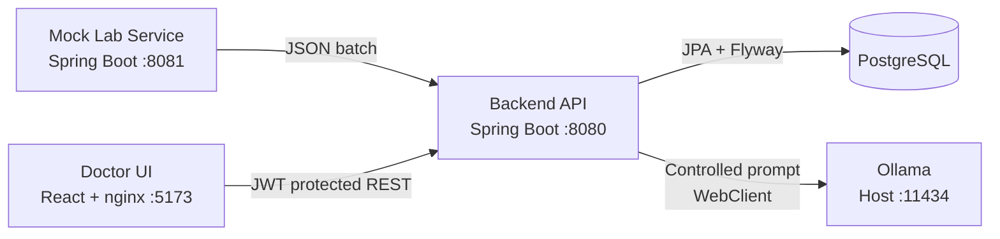

# Lab Results Smart Assistant

Bir laboratuvar cihazından gelen test sonuçlarını periyodik olarak alan, doğrulayan, saklayan,
anormallikleri belirleyen ve doktora yerel LLM destekli ön değerlendirme sunan full-stack teknik
değerlendirme projesidir.

Bu projeyi yalnızca “çalışan bir demo” olarak değil; bozuk veri, duplicate mesaj, cihaz kesintisi,
LLM timeout'u ve hatalı model çıktısı gibi durumlarda davranışı açıklanabilir küçük bir sistem olarak
tasarladım. Sistemde gerçek hasta verisi yoktur. AI çıktısı tanı değildir.

[](https://github.com/dselimozcelik/lab-results-smart-assistant/actions/workflows/ci.yml)

## 5 Dakikada Değerlendirme

### 1. Sistemi çalıştırın

Gereksinimler: Docker ve AI analizi için host makinede Ollama.

```bash
ollama pull gemma2:9b
docker compose -f docker-compose.full.yml up --build
```

Backend hazır olduğunda:

```bash
curl http://localhost:8080/actuator/health
```

Uygulama: [http://localhost:5173](http://localhost:5173)

```text
Kullanıcı adı: doctor
Şifre: Doctor123!
```

### 2. Temel akışı inceleyin

1. Login olun ve hasta listesini açın.
2. Arama alanına küçük harfle `p-` yazıp önerileri gözlemleyin.
3. Kritik bir hastayı açıp tüp içindeki testleri ve referans aralıklarını inceleyin.
4. Bir tüp için `AI analizi al` butonunu kullanın.
5. Swagger ve audit log üzerinden backend davranışını inceleyin.

### 3. Teknik kanıtları inceleyin

| İnceleme amacı | Belge |
|---|---|
| Mimari ve kararların ayrıntılı savunması | [Teknik tasarım](docs/technical-design.md) |
| Case maddelerinin nasıl karşılandığı | [Gereksinim karşılama matrisi](docs/requirements-traceability.md) |
| Test stratejisi ve failure-mode kanıtları | [Test ve kanıt raporu](docs/testing-and-evidence.md) |
| Tekrarlanabilir kurulum ve demo | [Demo ve kullanım kılavuzu](docs/demo-guide.md) |
| AI araçlarının kullanımı ve benim rolüm | [AI destekli geliştirme yaklaşımı](docs/ai-assisted-development.md) |
| Teslim ekranları | [Görsel kanıt paketi](#görsel-kanıt-paketi) |

## Gereksinimlerin Karşılanma Özeti

| Case beklentisi | Uygulama |
|---|---|
| Lab cihazı mock servisi | Ayrı Spring Boot servis; normal ve 8 kontrollü senaryo |
| Periyodik veri çekme | `@Scheduled(fixedDelay)` kullanan backend poller |
| Validation ve saklama | Tüp/test seviyesinde validation, PostgreSQL, Flyway |
| REST API | JWT korumalı hasta, detay, AI analizi ve audit endpoint'leri |
| AI ön analizi | Host üzerinde Ollama, kontrollü prompt, JSON doğrulama ve cache |
| Loglama | Uygulama logları ve kalıcı polling audit kayıtları |
| Doktor frontend'i | React, login, hasta arama/filtreleme, detay ve AI durumları |
| Kolay çalıştırma | Full-stack Docker Compose ve yerel geliştirme yöntemi |
| Test ve kalite | Backend, mock ve frontend testleri; GitHub Actions CI |

Maddenin kod ve kanıt bağlantıları için
[gereksinim karşılama matrisine](docs/requirements-traceability.md) bakılabilir.

## Mimari



Uçtan uca veri akışı:

```text
Mock cihaz
  -> fixedDelay poller
  -> tüp/test validation
  -> duplicate kontrolü
  -> deterministic anomaly sınıflandırması
  -> PostgreSQL + audit kaydı
  -> JWT korumalı REST API
  -> doktor arayüzü
  -> isteğe bağlı kontrollü Ollama analizi
```

Domain modelini `hasta -> tüp/numune -> testler` şeklinde kurdum. Çünkü laboratuvar cihazından aynı
kan alımına ait birden fazla test birlikte gelir ve AI değerlendirmesi tek değerden çok panel
bağlamında anlamlıdır. Ayrıntılı gerekçe:
[Teknik tasarım - Domain modeli](docs/technical-design.md#domain-modeli-hasta---tüp---test).

## Öne Çıkan Mühendislik Kararları

### Polling için neden `fixedDelay`?

Bir cycle yavaşladığında yenisinin önceki bitmeden başlamasını istemedim. `fixedDelay`, cihaz veya
veritabanı yavaşken üst üste binen ingestion işlemlerini engeller. Poll başarısız olursa backend
çökmez; hata audit'e yazılır ve sonraki cycle tekrar denenir.

### Geçersiz test neden tamamen silinmiyor?

Tüp güvenilir fakat içindeki tek bir testin değeri/birimi bozuksa testi `INVALID` olarak saklıyorum.
Böylece doktor “bu test hiç gelmedi” ile “geldi fakat kullanılamaz” durumlarını ayırt edebilir.
Tüp zamanı güvenilir değilse bütün tüp reddedilir.

### Duplicate nasıl engelleniyor?

`sampleId` veritabanında unique'tir. Servis aynı batch içindeki ve daha önce saklanan duplicate
tüpleri önceden filtreler; veritabanı constraint'i son güvenlik katmanıdır. Duplicate kayıt
eklenmez fakat audit log'da görünür.

### Anomaly hesabı neden LLM'e bırakılmıyor?

`NORMAL/LOW/HIGH/CRITICAL/INVALID` durumları deterministic Java koduyla hesaplanır. LLM yalnızca
backend'in sağladığı gerçekleri yorumlar. Böylece model referans aralığı uyduramaz veya kritik
durumu yeniden sınıflandıramaz.

### LLM çıktısına neden tamamen güvenilmiyor?

- Prompt yalnızca backend tarafından üretilen panel özetini içerir.
- `temperature=0` ve JSON çıktı formatı kullanılır.
- Boş/bozuk çıktı reddedilir.
- `flaggedTests` modelden değil backend durumlarından üretilir.
- Disclaimer backend tarafından zorunlu eklenir.
- Timeout/Ollama kesintisi kontrollü `503` olur; uygulamanın kalanı çalışmaya devam eder.
- Sonuç `(sample, model, promptVersion)` ile cache'lenir.

### Login güvenliği nasıl ele alındı?

Parola geri çözülebilir encryption ile değil, tek yönlü BCrypt hash olarak saklanır. Login sonrası
süreli ve imzalı JWT üretilir; JWT şifreli olmadığı için içine hassas veri konmaz. Frontend token'ı
`localStorage` yerine memory'de tutar ve session bittiğinde query cache'i temizler.

Bu kararların alternatifleri ve production karşılıkları
[teknik tasarım belgesinde](docs/technical-design.md) açıklanmıştır.

## İş Kuralları

| Durum | Kural |
|---|---|
| `NORMAL` | Değer referans aralığında |
| `LOW` | Değer referans minimumunun altında |
| `HIGH` | Değer referans maksimumunun üstünde |
| `CRITICAL` | Değer, referans sınırını aralık genişliğinin yapılandırılabilir oranından fazla aşıyor |
| `INVALID` | Eksik/geçersiz değer, birim veya referans sınırı |

Varsayılan kritik faktör:

```text
value < min - 0.5 * (max - min)
veya
value > max + 0.5 * (max - min)
```

Bu formül açıklanabilir bir demo heuristiğidir, klinik gerçek değildir. Production ortamında
test bazlı klinik panic değerleri kullanılmalıdır.

## Test ve Doğrulama

```bash
cd backend-api && ./mvnw test
cd mock-lab-service && ./mvnw test
cd frontend && npm ci && npm test && npm run lint && npm run build
```

- Backend integration testleri gerçek PostgreSQL'i Testcontainers ile başlatır.
- Device ve Ollama testlerde MockWebServer ile izole edilir.
- Frontend testleri kullanıcı davranışlarını Testing Library ile doğrular.
- Testler gerçek Ollama veya çalışan mock servis gerektirmez.
- Her push ve pull request'te [GitHub Actions CI](https://github.com/dselimozcelik/lab-results-smart-assistant/actions/workflows/ci.yml)
  çalışır.

Güncel test sayıları, senaryolar ve son doğrulama sonuçları:
[Test ve kanıt raporu](docs/testing-and-evidence.md).

## API ve Adresler

| Amaç | Adres |
|---|---|
| Frontend | [http://localhost:5173](http://localhost:5173) |
| Backend health | [http://localhost:8080/actuator/health](http://localhost:8080/actuator/health) |
| Mock health | [http://localhost:8081/actuator/health](http://localhost:8081/actuator/health) |
| Swagger UI | [http://localhost:8080/swagger-ui/index.html](http://localhost:8080/swagger-ui/index.html) |
| OpenAPI JSON | [http://localhost:8080/v3/api-docs](http://localhost:8080/v3/api-docs) |

Temel JWT korumalı endpoint'ler:

```text
GET  /api/patients
GET  /api/patients/suggestions?query=P-
GET  /api/patients/{patientId}
POST /api/samples/{sampleId}/ai-analysis
GET  /api/audit-logs
```

Mock cihaz senaryoları:

```text
GET /api/device-results/batch?scenario=normal|abnormal|critical|duplicate|missing-field|invalid-unit|stale|device-error
```

## Bilinçli Sınırlamalar

Bu çözüm bir single-node teknik değerlendirme demosudur; production-ready olduğu iddia edilmemektedir.

| Sınırlama | Neden bu kapsamda yapılmadı? | Production yaklaşımı |
|---|---|---|
| Senkron LLM çağrısı | Demo akışını sade ve doğrudan tutmak | Queue + worker + job status |
| Tek global kritik faktör | Açıklanabilir demo kuralı yeterli | Test bazlı klinik panic değerleri |
| Tek `DOCTOR` rolü | Case ek rol istemiyor | Identity provider + RBAC |
| Memory'de JWT | Token'ı browser storage'da bırakmamak | BFF veya güvenli session/cookie tasarımı |
| Tek instance polling | Multi-instance açıkça kapsam dışı | ShedLock/distributed scheduler |
| HTTP localhost | Lokal demo | TLS, secret manager, network policy |
| WebSocket yok | 10 saniyelik yenileme demo için yeterli | Event/push tabanlı güncelleme |

Refresh token rotation, multi-model LLM, Kubernetes ve gerçek hasta verisi de bilinçli olarak kapsam
dışında bırakılmıştır.

## Görsel Kanıt Paketi

| Görsel | Kanıtladığı davranış |
|---|---|
| [Login ekranı](docs/screenshots/01-login.png) | Doktor girişi |
| [Arama önerileri](docs/screenshots/02-patient-search-suggestions.png) | Case-insensitive ve debounce'lu hasta keşfi |
| [Kritik hasta listesi](docs/screenshots/03-critical-patient-list.png) | Kritik sonuçların görsel olarak ayrılması |
| [Tüp detay ekranı](docs/screenshots/04-patient-tube-detail.png) | Panel modeli, referans aralığı ve durumlar |
| [AI analizi](docs/screenshots/05-ai-analysis.png) | Özet, takip önerileri ve disclaimer |
| [Swagger UI](docs/screenshots/06-swagger-ui.png) | API dokümantasyonu |
| [Audit log cevabı](docs/screenshots/07-audit-log-response.png) | Kalıcı polling logları |
| [CI başarısı](docs/screenshots/08-ci-success.png) | Otomatik kalite kapısı |

## Doküman İndeksi

- [Teknik tasarım ve karar savunması](docs/technical-design.md)
- [Gereksinim karşılama matrisi](docs/requirements-traceability.md)
- [Test ve kanıt raporu](docs/testing-and-evidence.md)
- [Demo ve kullanım kılavuzu](docs/demo-guide.md)
- [AI destekli geliştirme yaklaşımı](docs/ai-assisted-development.md)
- [Gönderim e-postası taslağı](docs/submission-email.md)
