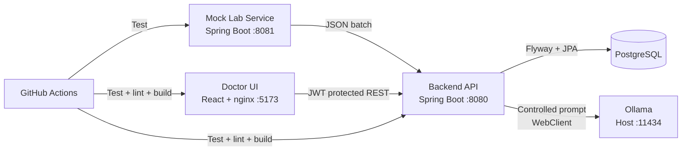

# Lab Results Smart Assistant

Bir hastanedeki laboratuvar cihazından gelen test sonuçlarını periyodik olarak alan, doğrulayan,
anormallik durumlarını hesaplayan ve doktorlara yerel bir LLM ile ön değerlendirme sunan full-stack
teknik değerlendirme projesidir.

Sistemdeki tüm hasta ve laboratuvar verileri demo amaçlı üretilmiştir. Gerçek hasta verisi içermez.
AI çıktısı tanı değildir ve doktor değerlendirmesinin yerini almaz.

## İçindekiler

- [Öne çıkan özellikler](#öne-çıkan-özellikler)
- [Mimari](#mimari)
- [Hızlı başlangıç: tüm sistem Docker ile](#hızlı-başlangıç-tüm-sistem-docker-ile)
- [Yerel geliştirme kurulumu](#yerel-geliştirme-kurulumu)
- [Demo hesabı ve adresler](#demo-hesabı-ve-adresler)
- [İş kuralları](#iş-kuralları)
- [Güvenlik modeli](#güvenlik-modeli)
- [LLM entegrasyonu](#llm-entegrasyonu)
- [API özeti](#api-özeti)
- [Testler ve CI](#testler-ve-ci)
- [Teknoloji ve kararlar](#teknoloji-ve-kararlar)
- [Bilinen sınırlamalar ve yapılmayanlar](#bilinen-sınırlamalar-ve-yapılmayanlar)
- [Ekran görüntüsü listesi](#ekran-görüntüsü-listesi)
- [Kullanım kılavuzu](#kullanım-kılavuzu)

## Öne çıkan özellikler

- Laboratuvar cihazını taklit eden bağımsız Spring Boot mock servis
- Normal, anormal, kritik, duplicate, eksik alan, geçersiz birim, stale ve cihaz hatası senaryoları
- `@Scheduled(fixedDelay)` ile çakışmayan periyodik veri çekme
- Tüp ve test seviyesinde validation, duplicate koruması ve audit log
- `NORMAL`, `LOW`, `HIGH`, `CRITICAL`, `INVALID` anormallik sınıflandırması
- JWT + BCrypt ile doktor girişi ve korumalı REST API
- Hasta arama önerileri, filtreleme, pagination ve anormal değerleri öne çıkaran React arayüzü
- Ollama üzerinden kontrollü, cache'lenen ve backend tarafından doğrulanan AI ön analizi
- Tutarlı RFC 7807 `ProblemDetail` hata cevapları
- Swagger/OpenAPI dokümantasyonu
- Testcontainers, MockWebServer ve frontend davranış testleri
- GitHub Actions CI ve tek komutluk full-stack Docker çalıştırma

## Mimari



Backend katmanları:

```text
HTTP request -> Controller -> Service -> Repository -> PostgreSQL
                               |
                               +-> DeviceClient / OllamaClient -> External HTTP service
```

Repo yapısı:

```text
mock-lab-service/   Laboratuvar cihazı simülasyonu
backend-api/        Polling, validation, auth, audit, REST ve LLM entegrasyonu
frontend/           React + TypeScript doktor arayüzü
docs/               Demo ve kullanım kılavuzu
.github/workflows/  CI
docker-compose.yml       Geliştirme için yalnızca PostgreSQL
docker-compose.full.yml  Teslim için tüm uygulama stack'i
```

## Hızlı başlangıç: tüm sistem Docker ile

### Gereksinimler

- Docker Desktop veya Docker Engine + Compose
- AI analizi kullanılacaksa host makinede [Ollama](https://ollama.com/)

Ollama modelini hazırlayın:

```bash
ollama pull gemma2:9b
ollama serve
```

Ollama masaüstü uygulaması zaten çalışıyorsa ayrıca `ollama serve` çalıştırmanız gerekmez.

Tüm sistemi başlatın:

```bash
docker compose -f docker-compose.full.yml up --build
```

Backend ilk açılışta Flyway migration'larını çalıştırır. Health endpoint `UP` olduktan sonra
uygulamayı açın:

```bash
curl http://localhost:8080/actuator/health
```

Tarayıcı: [http://localhost:5173](http://localhost:5173)

Sistemi durdurmak:

```bash
docker compose -f docker-compose.full.yml down
```

Veritabanı volume'u dahil tamamen temizlemek:

```bash
docker compose -f docker-compose.full.yml down -v
```

Portlar doluysa host portları değiştirilebilir:

```bash
FRONTEND_PORT=15173 BACKEND_PORT=18080 MOCK_LAB_PORT=18081 \
docker compose -f docker-compose.full.yml up --build
```

## Yerel geliştirme kurulumu

### Gereksinimler

- Java 17
- Node.js 22
- Docker
- AI analizi için Ollama ve `gemma2:9b`

1. PostgreSQL'i başlatın:

```bash
docker compose up -d
```

2. Mock servisi başlatın:

```bash
cd mock-lab-service
./mvnw spring-boot:run
```

3. Ayrı terminalde backend'i başlatın:

```bash
cd backend-api
./mvnw spring-boot:run
```

4. Ayrı terminalde frontend'i başlatın:

```bash
cd frontend
npm ci
npm run dev
```

Development profili varsayılan olarak şunları kullanır:

- PostgreSQL: `localhost:5432`
- Mock servis: `localhost:8081`
- Backend: `localhost:8080`
- Frontend: `localhost:5173`
- Ollama: `localhost:11434`

## Demo hesabı ve adresler

| Amaç | Değer |
|---|---|
| Kullanıcı adı | `doctor` |
| Şifre | `Doctor123!` |
| Frontend | [http://localhost:5173](http://localhost:5173) |
| Backend health | [http://localhost:8080/actuator/health](http://localhost:8080/actuator/health) |
| Mock health | [http://localhost:8081/actuator/health](http://localhost:8081/actuator/health) |
| Swagger UI | [http://localhost:8080/swagger-ui/index.html](http://localhost:8080/swagger-ui/index.html) |
| OpenAPI JSON | [http://localhost:8080/v3/api-docs](http://localhost:8080/v3/api-docs) |

Demo doktor Flyway migration'ı ile BCrypt hash olarak seed edilir. Gerçek sistemde kullanıcılar
admin/identity sistemi tarafından oluşturulur; public kayıt endpoint'i bulunmaz.

## Güvenlik modeli

- Parola veritabanında düz metin veya geri çözülebilir şifreleme ile tutulmaz; tek yönlü BCrypt hash
  olarak saklanır.
- Login başarılı olduğunda backend süreli ve imzalı bir JWT üretir. JWT imzalıdır fakat şifreli
  değildir; içine hassas veri konulmaz.
- Frontend token'ı `localStorage` yerine memory'de tutar ve logout/expiry sırasında query cache'i temizler.
- Yetkisiz API istekleri `401`, geçersiz input `400 ProblemDetail` döndürür.
- Demo localhost üzerinde HTTP kullanır. Production ortamında login ve bütün trafik reverse proxy/load
  balancer seviyesinde TLS/HTTPS ile şifrelenmelidir.
- Docker profilindeki demo JWT secret yalnızca kolay kurulum içindir; production secret manager
  kullanılmalıdır.

## İş kuralları

### Anormallik sınıflandırması

| Durum | Kural |
|---|---|
| `NORMAL` | Değer referans aralığında |
| `LOW` | Değer referans minimumunun altında |
| `HIGH` | Değer referans maksimumunun üstünde |
| `CRITICAL` | Değer, referans sınırını aralık genişliğinin yapılandırılabilir oranından daha fazla aşıyor |
| `INVALID` | Eksik/geçersiz değer, birim veya referans sınırı |

Varsayılan kritik faktör `0.5` değeridir:

```text
value < min - 0.5 * (max - min)
veya
value > max + 0.5 * (max - min)
```

Bu yalnızca demo amaçlı açıklanabilir bir heuristiktir, klinik gerçek değildir. Production sisteminde
test bazlı klinik panic değerleri kullanılmalıdır.

### Validation ve idempotency

- Tüp kimliği, hasta kimliği, ölçüm zamanı ve cihaz kimliği yapısal olarak zorunludur.
- Gelecekteki veya 180 günden eski tüpler reddedilir ve audit log'a yazılır.
- Eksik değer, bilinmeyen birim veya bozuk referans aralığı olan test görünür kalması için
  `INVALID` olarak saklanır.
- `sampleId` veritabanında unique'tir. Duplicate tüpler eklenmez, audit log'a yazılır.
- Her polling cycle fetched/valid/invalid/duplicate sayılarını ve detaylarını saklar.
- Mock servis kapalıysa veya timeout olursa backend çökmez; cycle loglanır ve sonraki turda tekrar dener.

## LLM entegrasyonu

AI analizi tek bir tüpteki bütün panel için üretilir:

1. Backend test değerlerini ve hesaplanmış durumları deterministic bir özet haline getirir.
2. Kontrollü prompt yalnızca bu özeti Ollama'ya gönderir.
3. Ollama'dan JSON formatında `summary` ve `suggestedFollowups` alınır.
4. Modelin `flaggedTests` iddiasına güvenilmez; işaretlenen testler backend durumlarından üretilir.
5. Boş veya bozuk model çıktısı reddedilir.
6. Disclaimer backend tarafından zorunlu olarak eklenir.
7. Sonuç `(sample, model, promptVersion)` anahtarı ile cache'lenir.

Aktif prompt: [`backend-api/src/main/resources/prompts/ai-analysis-v4.txt`](backend-api/src/main/resources/prompts/ai-analysis-v4.txt)

Neden yerel Ollama: laboratuvar verisini üçüncü taraf servise göndermeden demo yapılabilir. Model URL'si,
model adı ve timeout config üzerinden değiştirilebilir.

## API özeti

Public endpoint'ler:

| Method | Endpoint | Amaç |
|---|---|---|
| `POST` | `/api/auth/login` | JWT al |
| `GET` | `/actuator/health` | Backend health |
| `GET` | `/v3/api-docs` | OpenAPI tanımı |
| `GET` | `/swagger-ui/index.html` | Swagger UI |

JWT gerektiren endpoint'ler:

| Method | Endpoint | Amaç |
|---|---|---|
| `GET` | `/api/patients` | Hasta listesi, filtre ve pagination |
| `GET` | `/api/patients/suggestions?query=P-` | Hasta numarası önerileri |
| `GET` | `/api/patients/{patientId}` | Hastanın tüp ve test detayları |
| `POST` | `/api/samples/{sampleId}/ai-analysis` | Tüp için AI ön analizi |
| `GET` | `/api/audit-logs` | Polling audit kayıtları |

Mock servis endpoint'i:

```text
GET /api/device-results/batch
GET /api/device-results/batch?scenario=normal|abnormal|critical|duplicate|missing-field|invalid-unit|stale|device-error
GET /api/device-results/batch?seed=42
```

Liste endpoint'leri en fazla `100` kayıt döndürür. Geçersiz enum, tarih veya request body için API
`500` yerine tutarlı `400 ProblemDetail` döndürür.

## Testler ve CI

Backend testleri gerçek PostgreSQL'i Testcontainers ile başlatır. Mock servis ve Ollama testlerde
MockWebServer/MockBean ile izole edilir; testleri çalıştırmak için gerçek mock servis veya Ollama gerekmez.

```bash
cd backend-api && ./mvnw test
cd mock-lab-service && ./mvnw test
cd frontend && npm ci && npm test && npm run lint && npm run build
```

Mevcut kapsam:

- Backend: validation, anomaly hesabı, duplicate, audit, auth, query validation, timeout, LLM payload/output
- Mock servis: scenario factory ve HTTP davranışları
- Frontend: login, hasta arama/öneri, liste/navigasyon, durum rozeti ve AI durumları
- GitHub Actions: her push ve pull request'te backend, mock ve frontend job'ları

## Teknoloji ve kararlar

| Tercih | Neden |
|---|---|
| Spring Boot 3 + Java 17 | İstenen stack; katmanlı, test edilebilir backend |
| PostgreSQL + JPA + Flyway | Gerçek ilişkisel sorgular ve version-controlled schema |
| React + TypeScript + Vite | Tip güvenli, hızlı ve sade SPA geliştirme |
| TanStack Query | API cache, loading/error state ve periyodik yenileme |
| JWT + BCrypt | Stateless auth ve hash'lenmiş parola |
| Raw WebClient | Tek cihaz ve tek Ollama endpoint'i için küçük, açık entegrasyon |
| Ollama | Veriyi host dışına göndermeyen yerel LLM |
| Testcontainers | PostgreSQL'e özgü davranışları gerçek veritabanında test etme |
| nginx | Docker tesliminde statik frontend ve same-origin `/api` proxy |
| `fixedDelay` polling | Yavaş bir cycle bitmeden yenisinin başlamaması |

Önemli trade-off'lar:

- JWT yalnızca memory'de tutulur. Sayfa yenilemede tekrar login gerekir, fakat token browser storage'da kalmaz.
- LLM çağrısı demo için senkrondur. Production'da queue/worker tercih edilir.
- Audit ve polling tek instance varsayar. Multi-instance scheduler locking bu demo kapsamı dışındadır.
- Doktor arayüzünde sonuçlar 10 saniyede bir yenilenir; websocket eklenmemiştir.

## Bilinen sınırlamalar ve yapılmayanlar

- Refresh token rotation ve kalıcı oturum
- `DOCTOR` dışında roller ve kullanıcı yönetimi
- WebSocket/gerçek zamanlı push
- Multi-model LLM seçimi
- Asenkron LLM queue/worker
- Multi-instance scheduler locking/ShedLock
- Kubernetes
- Test bazlı gerçek klinik panic değerleri
- TLS termination, secret manager ve production identity provider
- Gerçek hasta verisi ve production güvenlik/compliance sertleştirmeleri

Bu özellikler ödev kapsamına doğrudan değer katmadığı veya açıkça kapsam dışı olduğu için eklenmedi.

## Ekran görüntüsü listesi

Teslim ekran görüntüleri için önerilen sıra:

1. Login ekranı
2. Hasta listesi ve arama önerileri
3. Kritik/anormal hasta satırı
4. Hasta detayında tüp ve referans aralıkları
5. Başarılı AI ön analizi ve disclaimer
6. Swagger UI veya audit log cevabı

## Kullanım kılavuzu

Kurulum, uçtan uca demo, scenario komutları ve sorun giderme için:

[`docs/demo-guide.md`](docs/demo-guide.md)
