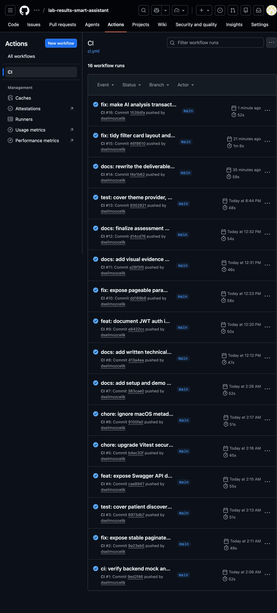

# Kurulum ve Demo Kılavuzu

Bu kılavuz, sistemi **ilk kez gören birinin** kurulumu tamamlamasını, temel akışı adım adım
görmesini ve değerlendirme demosunu tekrarlanabilir biçimde sunmasını sağlar.

- Kararların gerekçesi → [Teknik Tasarım](teknik-tasarim.md)
- Hızlı bakış → [README](../README.md)

---

## İçindekiler

1. [Docker burada ne işe yarıyor?](#1-docker-burada-ne-işe-yarıyor)
2. [Ön gereksinimler](#2-ön-gereksinimler)
3. [Yöntem A — Tüm sistemi Docker ile çalıştırma (önerilen)](#3-yöntem-a--tüm-sistemi-docker-ile-çalıştırma-önerilen)
4. [Yöntem B — Lokal geliştirme](#4-yöntem-b--lokal-geliştirme)
5. [Adım adım demo akışı](#5-adım-adım-demo-akışı)
6. [Mock cihaz senaryolarını gösterme](#6-mock-cihaz-senaryolarını-gösterme)
7. [API'yi curl ile gezme](#7-apiyi-curl-ile-gezme)
8. [Swagger UI](#8-swagger-ui)
9. [Testleri çalıştırma](#9-testleri-çalıştırma)
10. [Durdurma ve veriyi sıfırlama](#10-durdurma-ve-veriyi-sıfırlama)
11. [Sorun giderme](#11-sorun-giderme)

---

## 1. Docker burada ne işe yarıyor?

Sistem **dört ayrı parçadan** oluşur, her biri farklı bir teknolojiyle yazılmıştır:

| Parça | Teknoloji | Görevi |
|---|---|---|
| PostgreSQL | — | Veritabanı |
| mock-lab-service | Java / Spring Boot | Lab cihazını simüle eder (panel JSON üretir) |
| backend-api | Java / Spring Boot | Polling, validation, REST, LLM çağrısı |
| frontend | React → nginx | Doktorun gördüğü arayüz |

Docker olmasaydı, kuran kişinin makinesine **tek tek** doğru Java sürümünü, Maven'ı, Node.js'i ve
PostgreSQL'i kurması, hepsini doğru portlarda başlatıp birbirine bağlaması gerekirdi. Bu hem
zaman alır hem de "bende çalışıyordu" türü ortam farklarına yol açar.

**Docker bunu çözer:** her parça, içinde ihtiyaç duyduğu her şey hazır olan kendi *container*'ında
gelir. `docker-compose.full.yml` bu dört parçayı **tek komutla** ayağa kaldırır ve aralarındaki ağı
otomatik kurar.

> **Sonuç:** Sistemi kuracak kişinin makinesinde yalnızca **Docker** (ve AI için **Ollama**)
> kurulu olması yeterlidir. Java, Node veya PostgreSQL kurmasına gerek yoktur.

**İki ayrı compose dosyası neden var?** — bu bilinçli bir karardır:

- `docker-compose.yml` → **geliştirme**: yalnızca PostgreSQL Docker'da; üç uygulama host'ta hızlı
  reload ile çalışır.
- `docker-compose.full.yml` → **teslim**: dört parçanın tamamı tek komutla.

**Ollama neden Docker'da değil?** Yerel LLM büyük bir modeldir ve yaşam döngüsü (indirme, bellek)
host'ta daha doğru yönetilir. Container'lar Ollama'ya `host.docker.internal` üzerinden erişir
(Linux'ta full compose bu mapping'i otomatik ekler). Ollama erişilemese bile sistemin geri kalanı
çalışır; yalnızca AI paneli kontrollü bir hata gösterir.

---

## 2. Ön gereksinimler

- **Docker** ve **Docker Compose** çalışır durumda.
- `8080`, `8081`, `5173`, `5432` portları boş.
- AI analizi gösterilecekse **Ollama** çalışıyor ve `gemma2:9b` indirilmiş.
- API komutları için `jq` (opsiyonel, çıktıyı okunur kılar).

Kontrol:

```bash
docker version
docker compose version
ollama list           # gemma2:9b listede mi?
```

Model yoksa:

```bash
ollama pull gemma2:9b
```

Ollama servis olarak çalışmıyorsa:

```bash
ollama serve
```

---

## 3. Yöntem A — Tüm sistemi Docker ile çalıştırma (önerilen)

Repo kökünde:

```bash
docker compose -f docker-compose.full.yml up --build
```

İlk build bağımlılıkları indireceği için birkaç dakika sürebilir. Backend açılırken sırayla:

1. PostgreSQL'in **health** kontrolünü bekler (compose `depends_on: service_healthy`).
2. **Flyway** migration'larını uygular (V1 → V8).
3. Mock servisten **periyodik** veri çekmeye başlar (her 10 sn).

Ayrı bir terminalde doğrulayın:

```bash
curl http://localhost:8080/actuator/health     # {"status":"UP"}
curl http://localhost:8081/actuator/health     # {"status":"UP"}
curl -I http://localhost:5173                   # HTTP/1.1 200
```

Portlardan biri doluysa, hepsi parametriktir:

```bash
FRONTEND_PORT=15173 BACKEND_PORT=18080 MOCK_LAB_PORT=18081 \
docker compose -f docker-compose.full.yml up --build
```

Bu durumda arayüz `http://localhost:15173` olur.

---

## 4. Yöntem B — Lokal geliştirme

Frontend/backend üzerinde hızlı geliştirme için yalnızca PostgreSQL'i Docker'da çalıştırın, üç
uygulamayı host'ta ayağa kaldırın.

```bash
docker compose up -d        # sadece PostgreSQL
```

Üç ayrı terminal:

```bash
# Terminal 1 — mock cihaz
cd mock-lab-service && ./mvnw spring-boot:run

# Terminal 2 — backend
cd backend-api && ./mvnw spring-boot:run

# Terminal 3 — frontend
cd frontend && npm ci && npm run dev
```

---

## 5. Adım adım demo akışı

Aşağıdaki akış, sistemin **her kritik kararını** çalışan ekranlarla gösterir.

### Önerilen inceleme sırası

| Adım | İşlem | Beklenen davranış | Kanıtladığı karar |
|---|---|---|---|
| 1 | Login | Korumalı hasta listesine geçilir | BCrypt + JWT + Spring Security |
| 2 | Aramaya `p-` yaz | Debounce sonrası öneri; liste hemen sorgulanmaz | Kontrollü, case-insensitive UX |
| 3 | Kritik hastayı aç | Tüp kartları; anormal testler üstte; referans bar | Domain modeli + deterministic anomaly |
| 4 | Test trendini aç | Tek testin zaman serisi grafiği | Hasta bağlamında izlenebilirlik |
| 5 | AI analizi iste | Loading → özet + flaggedTests + disclaimer | Kontrollü LLM + backend güvenlik sınırları |
| 6 | Audit log'a bak | Polling sayıları ve hata detayları | Gözlemlenebilir ingestion |

### 5.1 Login

Tarayıcıda **http://localhost:5173** açın.

```text
Kullanıcı adı: doctor
Şifre:         Doctor123!
```

Başarılı girişten sonra hasta listesi açılır. Mock cihaz her polling cycle'da yeni tüpler ürettiği
için liste zamanla büyür ve **10 saniyede bir** otomatik yenilenir. Kritik sonuçlar hem renk hem de
metin rozetiyle ayrışır (yalnız renge bağlı kalmamak bilinçli bir erişilebilirlik tercihidir).


### 5.2 Hasta arama ve filtreleme

1. Arama alanına **küçük harfle** `p-` yazın.
2. Yaklaşık 250 ms sonra eşleşen hasta numaraları öneri olarak görünür (debounce).
3. Bir öneri seçin — **liste hemen değişmez**.
4. Sorgu yalnızca **`Hastaları getir`** butonuna basınca uygulanır.
5. `Gelişmiş filtreler`i açıp test kodu / durum / tarih aralığı ile daraltın.

> Bu davranış, her tuş vuruşunda tüm listeyi sorgulamak yerine kontrollü bir UX sunar; öneri ile
> uygulanan sorgu birbirinden ayrıdır.


### 5.3 Hasta detayı: tüp, panel ve referans aralığı

Bir hasta satırına tıklayın. Detayda her **tüp ayrı bir kart**tır. Tüp içindeki testler **en ciddi
durum üstte** olacak şekilde sıralanır (CRITICAL → HIGH/LOW → INVALID → NORMAL). Her test için:

- Değer ve birim
- Referans aralığı
- Değerin aralığa göre konumunu gösteren **görsel referans bar**
- Anomali durumu (renk + rozet)


### 5.4 Test trendi (zaman serisi)

Bir testin geçmiş ölçümlerini görmek için trend grafiğini açın. Grafik, `GET /api/patients/{id}/
tests/{testCode}/history` ucundan gelen, **eskiden yeniye** sıralı sayısal değerleri gösterir; değeri
olmayan (INVALID) ölçümler dışarıda bırakılır.


### 5.5 AI ön analizi (çekirdek özellik)

1. Bir tüpte **`AI analizi al`** butonuna basın.
2. Buton **`Analiz ediliyor…`** durumuna geçer (loading).
3. Başarılı cevapta görünür:
   - Panelin Türkçe **özeti**,
   - **`flaggedTests`** — backend'in belirlediği anormal testler (modelden değil),
   - somut ve reçetesiz **takip önerileri**,
   - backend tarafından **zorunlu eklenen disclaimer**.
4. Aynı tüpte tekrar istek yapılırsa `(sample, model, promptVersion)` **cache**'i kullanılır; LLM
   yeniden çağrılmaz.

> Ollama çalışmıyorsa uygulamanın geri kalanı çalışmaya devam eder; panel kontrollü bir hata
> (`503 AI analysis unavailable`) gösterir ve hatalı/boş bir analiz **cache'e yazılmaz**.


### 5.6 Tema ve bildirimler

Arayüz, sistem tercihine duyarlı ve kalıcı bir **karanlık/aydınlık tema** toggle'ı içerir. Uzun
süren işlemlerin sonucu (örn. AI analizi tamamlandı/başarısız) **toast** bildirimleriyle iletilir.


---

## 6. Mock cihaz senaryolarını gösterme

Mock servisi doğrudan çağırarak tüm hata yolları görülebilir:

```bash
curl 'http://localhost:8081/api/device-results/batch?scenario=normal'
curl 'http://localhost:8081/api/device-results/batch?scenario=abnormal'
curl 'http://localhost:8081/api/device-results/batch?scenario=critical'
curl 'http://localhost:8081/api/device-results/batch?scenario=duplicate'
curl 'http://localhost:8081/api/device-results/batch?scenario=missing-field'
curl 'http://localhost:8081/api/device-results/batch?scenario=invalid-unit'
curl 'http://localhost:8081/api/device-results/batch?scenario=stale'
curl -i 'http://localhost:8081/api/device-results/batch?scenario=device-error'   # 503
```

Tekrarlanabilir rastgele batch için: `?seed=42`.

### Her senaryonun backend etkisi

| Senaryo | Backend / audit davranışı | UI etkisi |
|---|---|---|
| `normal` | Testler saklanır, `valid` sayısı artar | Normal rozet |
| `abnormal` | LOW/HIGH hesaplanır | Anormal satır + rozet |
| `critical` | CRITICAL hesaplanır | Kritik hasta/tüp öne çıkar |
| `duplicate` | Aynı `sampleId` tekrar eklenmez, `duplicate` sayısı artar | İkinci kayıt oluşmaz |
| `missing-field` | Güvenilir tüpte bozuk test `INVALID` saklanır | Geçersiz rozet |
| `invalid-unit` | Test `INVALID`, sebep audit detayında | Geçersiz rozet |
| `stale` | **Tüm tüp** reddedilir | Listeye eklenmez |
| `device-error` | Cycle failure audit edilir, backend çökmez | Mevcut veri görüntülenmeye devam eder |

Backend'i belirli bir senaryoyla başlatmak (lokal):

```bash
cd backend-api
./mvnw spring-boot:run -Dspring-boot.run.arguments=--lab.polling.scenario=critical
```

---

## 7. API'yi curl ile gezme

JWT alın:

```bash
TOKEN=$(curl -s http://localhost:8080/api/auth/login \
  -H 'Content-Type: application/json' \
  -d '{"username":"doctor","password":"Doctor123!"}' | jq -r '.token')
```

Hasta listesi ve filtreli sorgu:

```bash
curl -s http://localhost:8080/api/patients \
  -H "Authorization: Bearer $TOKEN" | jq

curl -s 'http://localhost:8080/api/patients?patientId=p-&status=CRITICAL&size=10' \
  -H "Authorization: Bearer $TOKEN" | jq
```

AI analizi (önce bir `sampleId` türetilir):

```bash
PATIENT_ID=$(curl -s http://localhost:8080/api/patients \
  -H "Authorization: Bearer $TOKEN" | jq -r '.content[0].patientId')

SAMPLE_ID=$(curl -s "http://localhost:8080/api/patients/$PATIENT_ID" \
  -H "Authorization: Bearer $TOKEN" | jq -r '.samples[0].sampleId')

curl -s -X POST "http://localhost:8080/api/samples/$SAMPLE_ID/ai-analysis" \
  -H "Authorization: Bearer $TOKEN" | jq
```

Audit log:

```bash
curl -s 'http://localhost:8080/api/audit-logs?size=10' \
  -H "Authorization: Bearer $TOKEN" | jq
```

---

## 8. Swagger UI

Interaktif API dokümantasyonu: **http://localhost:8080/swagger-ui/index.html**
OpenAPI JSON: **http://localhost:8080/v3/api-docs**

Swagger dokümantasyonu public'tir; iş endpoint'leri JWT olmadan çağrıldığında `401` döner.
Korumalı bir endpoint'i denemek için:

1. `POST /api/auth/login`'den token alın.
2. Sağ üstteki **`Authorize`** ile token'ı girin.
3. Örn. `GET /api/audit-logs` → `Try it out`; `page`, `size`, `sort` **ayrı alanlar** olarak gelir
   (tek bir `Pageable` JSON nesnesi değil — bu, OpenAPI sözleşmesinin doğru kurulduğunun işaretidir).


---

## 9. Testleri çalıştırma

```bash
# Backend — 43 test. Integration testleri Testcontainers ile gerçek PostgreSQL başlatır,
# bu yüzden Docker çalışmalıdır. Gerçek Ollama veya mock servis GEREKMEZ (MockWebServer).
cd backend-api && ./mvnw test

# Mock servis — 9 test
cd mock-lab-service && ./mvnw test

# Frontend — 14 test + lint + production build + güvenlik denetimi
cd frontend && npm ci && npm test && npm run lint && npm run build && npm audit --audit-level=high
```



---

## 10. Durdurma ve veriyi sıfırlama

```bash
docker compose -f docker-compose.full.yml down       # full stack'i durdur
docker compose -f docker-compose.full.yml down -v    # verisiyle birlikte tamamen sil
docker compose down -v                                # geliştirme PostgreSQL'ini sıfırla
```

---

## 11. Sorun giderme

### AI analizi alınamıyor
```bash
curl http://localhost:11434/api/tags     # Ollama ayakta mı?
ollama list                               # gemma2:9b var mı?
ollama pull gemma2:9b                      # yoksa indir
```
Sistem AI olmadan da çalışır; yalnızca AI paneli kontrollü hata gösterir.

### Frontend ilk açılışta kısa süre 502 gösteriyor
Backend Flyway + Spring context'i tamamlanmadan nginx proxy istek almış olabilir. `curl
http://localhost:8080/actuator/health` `UP` dönene kadar bekleyip sayfayı yenileyin.

### Port zaten kullanılıyor
Compose portları parametriktir:
```bash
FRONTEND_PORT=15173 BACKEND_PORT=18080 MOCK_LAB_PORT=18081 \
docker compose -f docker-compose.full.yml up --build
```

### Backend PostgreSQL'e bağlanamıyor
```bash
docker compose ps
docker compose logs postgres
```
Lokal geliştirmede backend `localhost:5432`, full compose içinde `postgres:5432` kullanır.

### Testcontainers Docker bulamıyor
`docker info` ile Docker'ın çalıştığını doğrulayın, sonra backend testini tekrar çalıştırın.
