# Kurulum ve Demo Kılavuzu

Bu kılavuz, sistemi ilk kez gören birinin kurulumu tamamlamasına, temel akışı adım adım görmesine ve
değerlendirme demosunu tekrarlanabilir biçimde sunmasına yardımcı olur.

- Kararların gerekçesi → [Teknik Tasarım](teknik-tasarim.md)
- Hızlı bakış → [README](../README.md)

---

## İçindekiler

1. [Docker burada ne işe yarıyor?](#1-docker-burada-ne-işe-yarıyor)
2. [Ön gereksinimler](#2-ön-gereksinimler)
3. [Repoyu indirme ve Ollama kurulumu](#3-repoyu-indirme-ve-ollama-kurulumu)
4. [Yöntem A — Tüm sistemi Docker ile çalıştırma (önerilen)](#4-yöntem-a--tüm-sistemi-docker-ile-çalıştırma-önerilen)
5. [Yöntem B — Lokal geliştirme](#5-yöntem-b--lokal-geliştirme)
6. [Adım adım demo akışı](#6-adım-adım-demo-akışı)
7. [Mock cihaz senaryolarını gösterme](#7-mock-cihaz-senaryolarını-gösterme)
8. [API'yi curl ile gezme](#8-apiyi-curl-ile-gezme)
9. [Swagger UI](#9-swagger-ui)
10. [Testleri çalıştırma](#10-testleri-çalıştırma)
11. [Durdurma ve veriyi sıfırlama](#11-durdurma-ve-veriyi-sıfırlama)
12. [Sorun giderme](#12-sorun-giderme)

---

## 1. Docker burada ne işe yarıyor?

Sistem dört ayrı parçadan oluşur, her biri farklı bir teknolojiyle yazıldı:

| Parça | Teknoloji | Görevi |
|---|---|---|
| PostgreSQL | — | Veritabanı |
| mock-lab-service | Java / Spring Boot | Lab cihazını simüle eder (panel JSON üretir) |
| backend-api | Java / Spring Boot | Polling, validation, REST, LLM çağrısı |
| frontend | React → nginx | Doktorun gördüğü arayüz |

Docker olmasaydı, kuran kişinin makinesine tek tek doğru Java sürümünü, Maven'ı, Node.js'i ve
PostgreSQL'i kurması, hepsini doğru portlarda başlatıp birbirine bağlaması gerekirdi. Bu hem zaman
alır hem de "bende çalışıyordu" türü ortam farklarına yol açar.

Docker bunu çözüyor: her parça, ihtiyaç duyduğu her şey içinde hazır olan kendi *container*'ıyla
gelir. `docker-compose.full.yml` bu dört parçayı tek komutla ayağa kaldırır ve aralarındaki ağı
otomatik kurar.

> Sonuç olarak sistemi kuracak kişinin makinesinde yalnızca Docker (ve AI için Ollama) kurulu olması
> yeterli. Java, Node ya da PostgreSQL kurmasına gerek yok.

İki ayrı compose dosyası olması bilinçli bir karar:

- `docker-compose.yml` (geliştirme): yalnızca PostgreSQL Docker'da; üç uygulama host'ta hızlı reload
  ile çalışır.
- `docker-compose.full.yml` (teslim): dört parçanın tamamı tek komutla.

Ollama neden Docker'da değil? Yerel LLM büyük bir model ve yaşam döngüsü host'ta daha doğru
yönetiliyor. Container'lar Ollama'ya `host.docker.internal` üzerinden erişir; Linux'ta full compose bu
mapping'i otomatik ekler. Ollama'ya ulaşılamasa bile sistemin geri kalanı çalışır; sadece AI paneli
kontrollü bir hata gösterir.

---

## 2. Ön gereksinimler

- [Git](https://git-scm.com/downloads)
- [Docker Desktop](https://docs.docker.com/get-started/introduction/get-docker-desktop/) ve Docker
  Compose çalışır durumda.
- [Ollama](https://ollama.com/download)
- `8080`, `8081`, `5173`, `5432` portları boş.
- AI analizi gösterilecekse Ollama çalışıyor ve `gemma2:9b` indirilmiş olmalı.
- API komutları için `jq` (opsiyonel, çıktıyı okunur kılar).
- `gemma2:9b` için en az 16 GB sistem belleği öneririm; daha düşük bellekte model yavaşlayabilir ya
  da hiç çalışmayabilir.

Kontrol:

```bash
docker version
docker compose version
ollama list           # gemma2:9b listede mi?
```

### İşletim sistemi notları

| Platform | Önerilen kurulum | Dikkat edilmesi gereken |
|---|---|---|
| Windows 10/11 | Docker Desktop + [**WSL 2 backend**](https://docs.docker.com/desktop/features/wsl/) + Linux containers; [Ollama Windows uygulaması](https://docs.ollama.com/windows) | Docker Desktop açık olmalı. PowerShell komutları kullanılabilir. WSL kullanılıyorsa repo performans için Linux dosya sistemine clone edilebilir. |
| macOS | Docker Desktop + Ollama macOS uygulaması | Apple Silicon ve Intel için uygun Docker/Ollama paketini seçin. |
| Linux | Docker Engine + Compose plugin veya Docker Desktop + Ollama | Compose dosyası `host.docker.internal:host-gateway` mapping'ini zaten ekler. |

Windows'ta Docker Desktop ayarlarında **Use the WSL 2 based engine** açık olmalı ve Docker
**Linux containers** modunda çalışmalıdır. Ollama Windows'ta arka planda çalışır ve API'yi
`http://localhost:11434` adresinde sunar. Container içindeki backend aynı servise
`host.docker.internal:11434` üzerinden ulaşır.

Repo bir `.gitattributes` taşır: shell script'leri ve `mvnw` LF, Windows launcher'ları (`.cmd`/`.bat`)
CRLF olarak normalize edilir. Böylece Windows'ta `git clone` yapan biri, Git'in satır sonu ayarından
bağımsız olarak hem Docker hem de lokal geliştirme yolunu bozulmadan çalıştırır.

---

## 3. Repoyu indirme ve Ollama kurulumu

Terminal, PowerShell veya WSL terminalinde:

```bash
git clone https://github.com/dselimozcelik/lab-results-smart-assistant.git
cd lab-results-smart-assistant

# Ollama kurulduktan sonra modeli indir
ollama pull gemma2:9b
```

Model birkaç GB olduğu için ilk indirme zaman alabilir. İndirme tamamlandığında:

```bash
ollama list
curl http://localhost:11434/api/tags
```

Windows PowerShell'de `curl` davranışı farklıysa şu kontrol kullanılabilir:

```powershell
Invoke-RestMethod http://localhost:11434/api/tags
```

Ollama masaüstü uygulaması çalışmıyorsa uygulamayı başlatın. CLI tabanlı Linux kurulumunda
gerekiyorsa ayrı bir terminalde `ollama serve` çalıştırın.

---

## 4. Yöntem A — Tüm sistemi Docker ile çalıştırma (önerilen)

Clone edilen repo kökünde:

```bash
export JWT_SECRET="$(openssl rand -base64 48)"
docker compose -f docker-compose.full.yml up --build
```

Tüm ortam değişkenleri (zorunlu/opsiyonel, açıklamalı varsayılanlar) repo kökündeki
`.env.example` dosyasındadır. İsterseniz `cp .env.example .env` ile kopyalayıp doldurun;
Compose `.env`'i otomatik okur. Yukarıdaki `export` yöntemi de geçerlidir.

`JWT_SECRET`, JWT token'larını imzalayan özel anahtardır. Repoda tahmin edilebilir bir varsayılan
bulunmaz: değişken verilmezse Compose başlamaz; 32 karakterden kısaysa backend startup sırasında
durur. Aynı çalışan sistemde mevcut token'ların geçerli kalması için yeniden başlatmalarda aynı özel
değeri kullanın. Production'da bu değer shell history yerine bir secret manager'dan sağlanmalıdır.
Bu bir demo çalıştırma yöntemidir: environment variable anahtarı repodan uzak tutar, fakat tek başına
secret manager değildir. Kararın tehdit modeli, trade-off'u ve production karşılığı
[Teknik Tasarım — JWT imzalama anahtarı](teknik-tasarim.md#jwt-imzalama-anahtarı-neden-zorunlu-environment-variable)
bölümünde açıklanır.

İlk build bağımlılıkları indireceği için birkaç dakika sürebilir. Backend açılırken sırayla:

1. PostgreSQL'in health kontrolünü bekler (compose `depends_on: service_healthy`).
2. Flyway migration'larını uygular (V1 → V8).
3. Mock servisten periyodik veri çekmeye başlar (varsayılan her 30 sn, cycle başına 1-2 tüp).

Ayrı bir terminalde doğrulayın:

```bash
curl http://localhost:8080/actuator/health     # {"status":"UP"}
curl http://localhost:8081/actuator/health     # {"status":"UP"}
curl -I http://localhost:5173                   # HTTP/1.1 200
```

Portlardan biri doluysa, hepsi parametriktir:

```bash
FRONTEND_PORT=15173 BACKEND_PORT=18080 MOCK_LAB_PORT=18081 \
docker compose -f docker-compose.full.yml up --build
```

Bu durumda arayüz `http://localhost:15173` olur.

Windows PowerShell'de port değiştirmek için:

```powershell
$bytes = New-Object byte[] 48
[Security.Cryptography.RandomNumberGenerator]::Create().GetBytes($bytes)
$env:JWT_SECRET=[Convert]::ToBase64String($bytes)
$env:FRONTEND_PORT="15173"
$env:BACKEND_PORT="18080"
$env:MOCK_LAB_PORT="18081"
docker compose -f docker-compose.full.yml up --build
```

Varsayılan veri üretimi kalıcı demo veritabanını hızla doldurmamak için sakindir. Daha hızlı bir
demo akışı istenirse polling aralığı değiştirilebilir:

```bash
POLLING_DELAY_MS=5000 docker compose -f docker-compose.full.yml up --build
```

Windows PowerShell:

```powershell
$env:POLLING_DELAY_MS="5000"
docker compose -f docker-compose.full.yml up --build
```

---

## 5. Yöntem B — Lokal geliştirme

Frontend/backend üzerinde hızlı geliştirme için yalnızca PostgreSQL'i Docker'da çalıştırın, üç
uygulamayı host'ta ayağa kaldırın. Bu yöntem için ayrıca Java 17 ve Node.js 22 gerekir. İlk kez
inceleyen ya da Windows kullanan bir değerlendirici için tam Docker yöntemi daha sade kalır.

```bash
docker compose up -d        # sadece PostgreSQL
```

Üç ayrı terminal:

```bash
# Terminal 1 — mock cihaz
cd mock-lab-service && ./mvnw spring-boot:run

# Terminal 2 — backend
export JWT_SECRET="$(openssl rand -base64 48)"
cd backend-api && ./mvnw spring-boot:run

# Terminal 3 — frontend
cd frontend && npm ci && npm run dev
```

Windows PowerShell'de Maven wrapper komutlarında `./mvnw` yerine `.\mvnw.cmd` kullanın:

```powershell
cd mock-lab-service
.\mvnw.cmd spring-boot:run
```

---

## 6. Adım adım demo akışı

Aşağıdaki akış, sistemin her kritik kararını çalışan ekranlarla gösterir.

### Önerilen inceleme sırası

| Adım | İşlem | Beklenen davranış | Kanıtladığı karar |
|---|---|---|---|
| 1 | Login | Korumalı hasta listesine geçilir | BCrypt + JWT + Spring Security |
| 2 | Aramaya `p-` yaz | Debounce sonrası öneri; liste hemen sorgulanmaz | Kontrollü, case-insensitive UX |
| 3 | Kritik hastayı aç | Tüp kartları; anormal testler üstte; referans bar | Domain modeli + deterministic anomaly |
| 4 | Test trendini aç | Tek testin zaman serisi grafiği | Hasta bağlamında izlenebilirlik |
| 5 | AI analizi iste | Loading → özet + flaggedTests + disclaimer | Kontrollü LLM + backend güvenlik sınırları |
| 6 | Audit log'a bak | Polling sayıları ve hata detayları | Gözlemlenebilir ingestion |

### 6.1 Login

Tarayıcıda http://localhost:5173 açın.

```text
Kullanıcı adı: doctor
Şifre:         Doctor123!
```

Bu hesap yalnızca localhost demosunun tekrarlanabilir kurulumu içindir ve parolası bilerek
dokümante edilmiştir. İnternete açık veya gerçek veri kullanan bir ortamda bu seed hesap
çalıştırılmaz; kullanıcı provisioning, geçici parola değişimi, rate-limit ve hesap kilitleme
gerekir.

Başarılı girişten sonra hasta listesi açılır. Mock cihaz her polling cycle'da yeni tüpler ürettiği
için liste zamanla büyür ve 30 saniyede bir otomatik yenilenir. Kritik sonuçlar hem renk hem de metin
rozetiyle ayrışır; yalnızca renge bağlı kalmamak bilinçli bir erişilebilirlik tercihi.

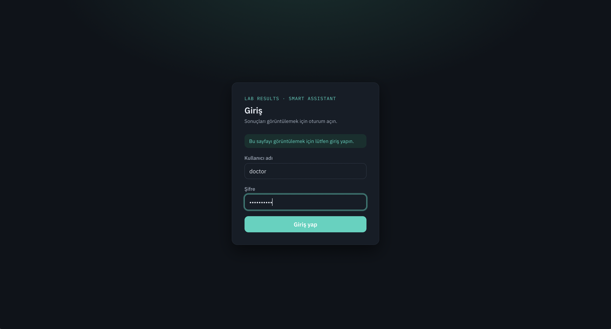

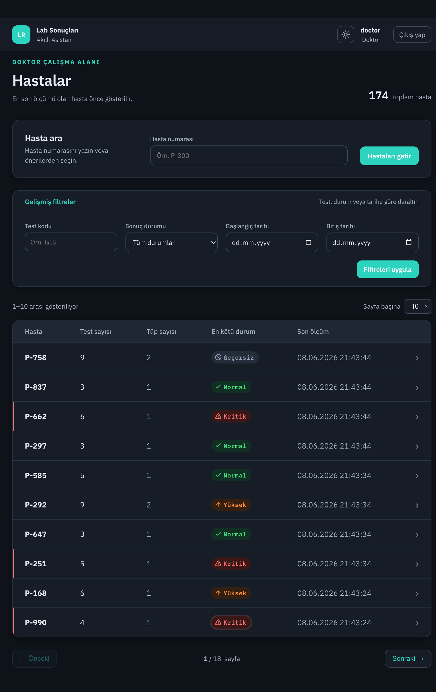

### 6.2 Hasta arama ve filtreleme

1. Arama alanına küçük harfle `p-` yazın.
2. Yaklaşık 250 ms sonra eşleşen hasta numaraları öneri olarak görünür (debounce).
3. Bir öneri seçin; liste hemen değişmez.
4. Sorgu yalnızca `Hastaları getir` butonuna basınca uygulanır.
5. `Gelişmiş filtreler`i açıp test kodu, durum veya tarih aralığıyla daraltın.

> Bu davranış, her tuş vuruşunda tüm listeyi sorgulamak yerine kontrollü bir UX sunuyor; öneri ile
> uygulanan sorgu birbirinden ayrı.

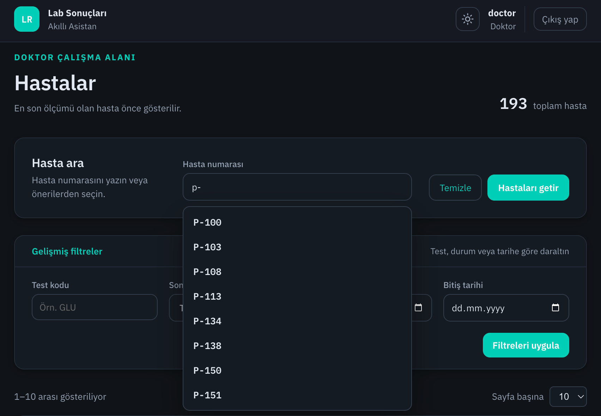

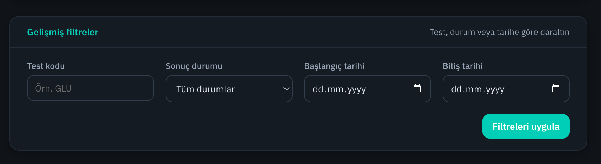

### 6.3 Hasta detayı: tüp, panel ve referans aralığı

Bir hasta satırına tıklayın. Detayda her tüp ayrı bir kart. Tüp içindeki testler en ciddi durum üstte
olacak şekilde sıralanır (CRITICAL → HIGH/LOW → INVALID → NORMAL). Her test için:

- Değer ve birim
- Referans aralığı
- Değerin aralığa göre konumunu gösteren görsel bir referans bar
- Anomali durumu (renk ve rozet)

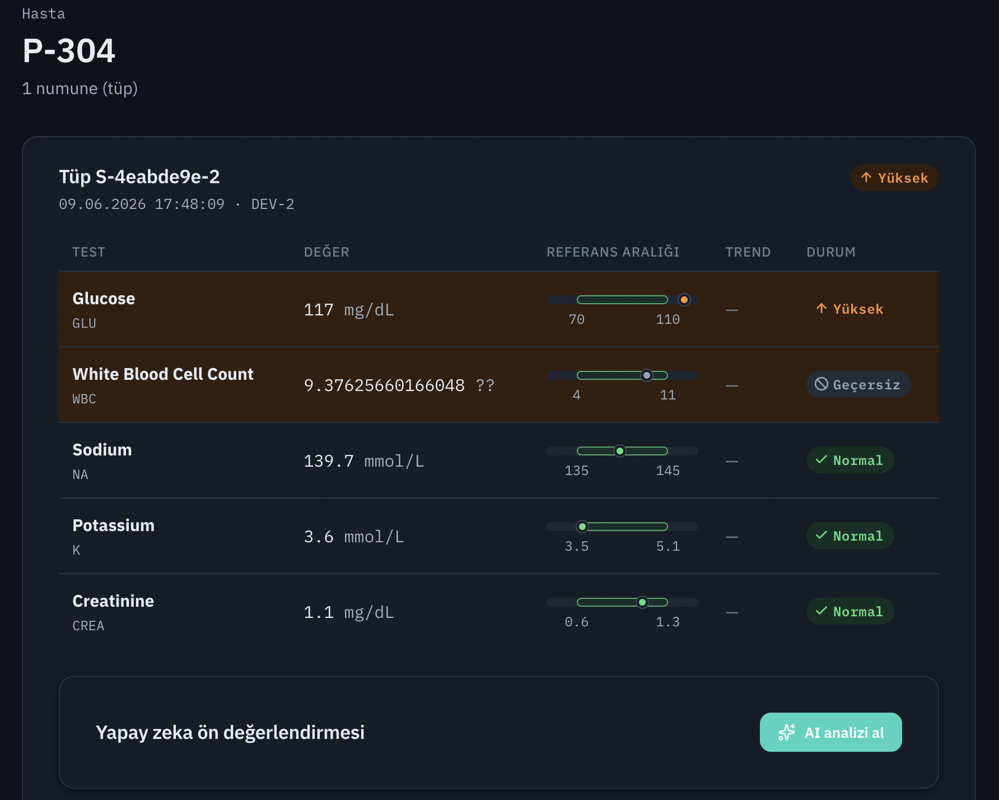

### 6.4 Test trendi (zaman serisi)

Bir testin geçmiş ölçümlerini görmek için trend grafiğini açın. Grafik, `GET /api/patients/{id}/
tests/{testCode}/history` ucundan gelen, eskiden yeniye sıralı sayısal değerleri gösterir; değeri
olmayan (INVALID) ölçümler dışarıda bırakılır.

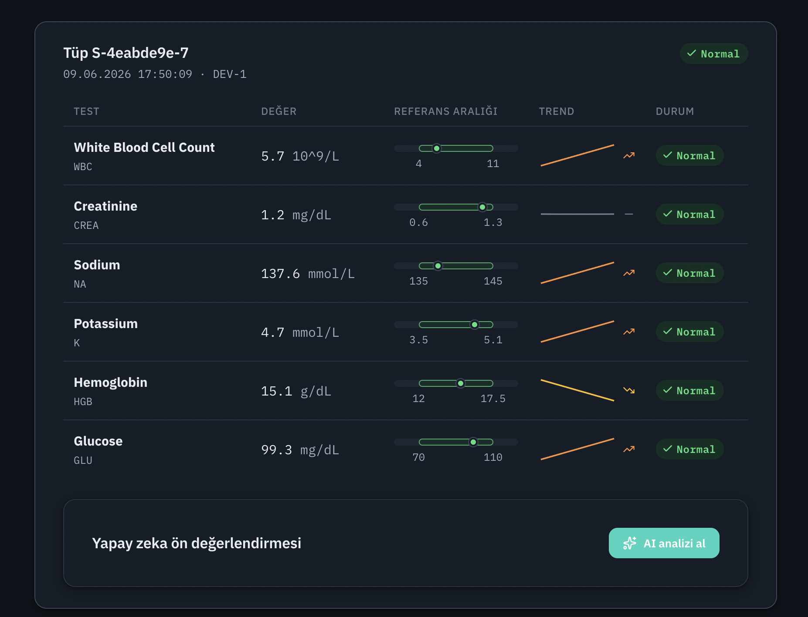

### 6.5 AI ön analizi (çekirdek özellik)

1. Bir tüpte `AI analizi al` butonuna basın.
2. Buton `Analiz ediliyor…` durumuna geçer (loading).
3. Başarılı cevapta şunlar görünür:
   - panelin Türkçe özeti,
   - `flaggedTests`: backend'in belirlediği anormal testler (modelden değil),
   - somut, reçetesiz takip önerileri,
   - backend'in zorunlu olarak eklediği disclaimer.
4. Aynı tüpte tekrar istek yapılırsa `(sample, model, promptVersion)` cache'i kullanılır; LLM yeniden
   çağrılmaz.

> Ollama çalışmıyorsa uygulamanın geri kalanı çalışmaya devam eder; panel kontrollü bir hata
> (`503 AI analysis unavailable`) gösterir ve hatalı veya boş bir analiz cache'e yazılmaz.

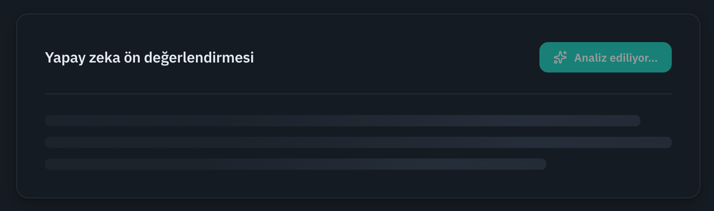

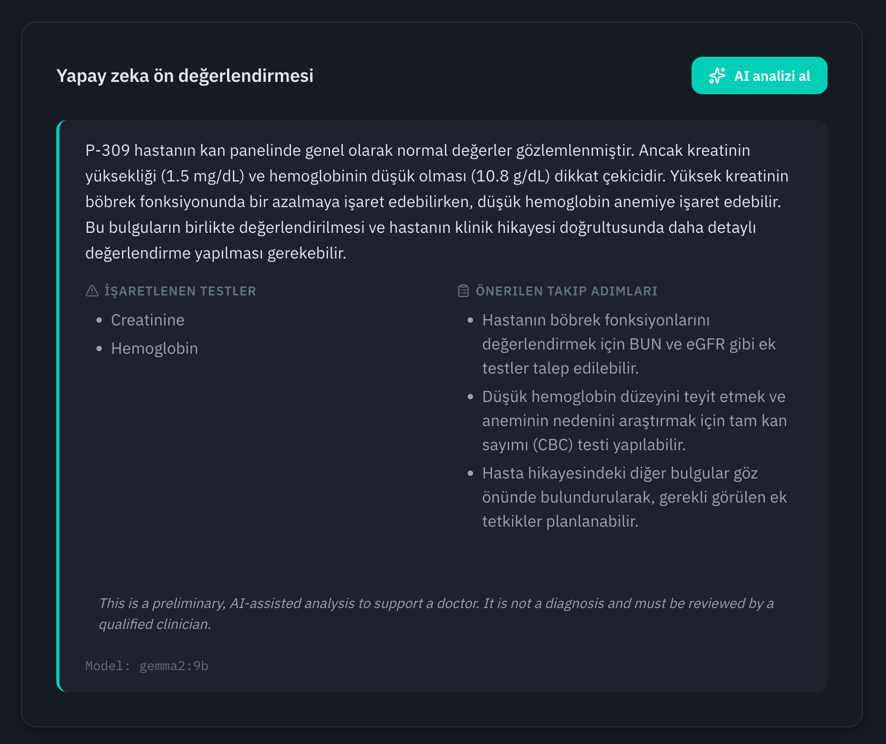

### 6.6 Tema ve bildirimler

Arayüzde sistem tercihine duyarlı, kalıcı bir karanlık/aydınlık tema toggle'ı var. Uzun süren
işlemlerin sonucu (örneğin AI analizi tamamlandı ya da başarısız oldu) toast bildirimleriyle iletilir.

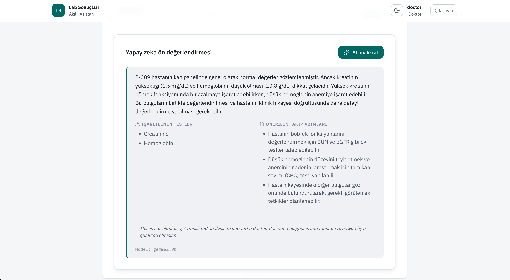

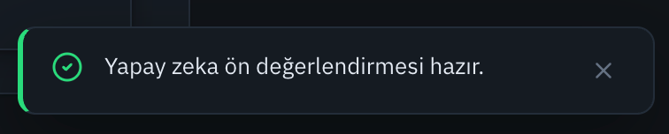

---

## 7. Mock cihaz senaryolarını gösterme

Mock servisi doğrudan çağırarak tüm hata yolları görülebilir:

```bash
curl 'http://localhost:8081/api/device-results/batch?scenario=normal'
curl 'http://localhost:8081/api/device-results/batch?scenario=abnormal'
curl 'http://localhost:8081/api/device-results/batch?scenario=critical'
curl 'http://localhost:8081/api/device-results/batch?scenario=duplicate'
curl 'http://localhost:8081/api/device-results/batch?scenario=missing-field'
curl 'http://localhost:8081/api/device-results/batch?scenario=invalid-unit'
curl 'http://localhost:8081/api/device-results/batch?scenario=stale'
curl -i 'http://localhost:8081/api/device-results/batch?scenario=device-error'   # 503
```

Tekrarlanabilir rastgele batch için: `?seed=42`.

### Her senaryonun backend etkisi

| Senaryo | Backend / audit davranışı | UI etkisi |
|---|---|---|
| `normal` | Testler saklanır, `valid` sayısı artar | Normal rozet |
| `abnormal` | LOW/HIGH hesaplanır | Anormal satır + rozet |
| `critical` | CRITICAL hesaplanır | Kritik hasta/tüp öne çıkar |
| `duplicate` | Aynı `sampleId` tekrar eklenmez, `duplicate` sayısı artar | İkinci kayıt oluşmaz |
| `missing-field` | Güvenilir tüpte bozuk test `INVALID` saklanır | Geçersiz rozet |
| `invalid-unit` | Test `INVALID`, sebep audit detayında | Geçersiz rozet |
| `stale` | Tüm tüp reddedilir | Listeye eklenmez |
| `device-error` | Cycle failure audit edilir, backend çökmez | Mevcut veri görüntülenmeye devam eder |

Backend'i belirli bir senaryoyla başlatmak (lokal):

```bash
cd backend-api
./mvnw spring-boot:run -Dspring-boot.run.arguments=--lab.polling.scenario=critical
```

---

## 8. API'yi curl ile gezme

JWT alın:

```bash
TOKEN=$(curl -s http://localhost:8080/api/auth/login \
  -H 'Content-Type: application/json' \
  -d '{"username":"doctor","password":"Doctor123!"}' | jq -r '.token')
```

Hasta listesi ve filtreli sorgu:

```bash
curl -s http://localhost:8080/api/patients \
  -H "Authorization: Bearer $TOKEN" | jq

curl -s 'http://localhost:8080/api/patients?patientId=p-&status=CRITICAL&size=10' \
  -H "Authorization: Bearer $TOKEN" | jq
```

AI analizi (önce bir `sampleId` türetilir):

```bash
PATIENT_ID=$(curl -s http://localhost:8080/api/patients \
  -H "Authorization: Bearer $TOKEN" | jq -r '.content[0].patientId')

SAMPLE_ID=$(curl -s "http://localhost:8080/api/patients/$PATIENT_ID" \
  -H "Authorization: Bearer $TOKEN" | jq -r '.samples[0].sampleId')

curl -s -X POST "http://localhost:8080/api/samples/$SAMPLE_ID/ai-analysis" \
  -H "Authorization: Bearer $TOKEN" | jq
```

Audit log:

```bash
curl -s 'http://localhost:8080/api/audit-logs?size=10' \
  -H "Authorization: Bearer $TOKEN" | jq
```

---

## 9. Swagger UI

Interaktif API dokümantasyonu: **http://localhost:8080/swagger-ui/index.html**
OpenAPI JSON: **http://localhost:8080/v3/api-docs**

Swagger dokümantasyonu public'tir; iş endpoint'leri JWT olmadan çağrıldığında `401` döner.
Korumalı bir endpoint'i denemek için:

1. `POST /api/auth/login`'den token alın.
2. Sağ üstteki **`Authorize`** ile token'ı girin.
3. Örneğin `GET /api/audit-logs` için `Try it out`; `page`, `size`, `sort` ayrı alanlar olarak gelir
   (tek bir `Pageable` JSON nesnesi değil; bu, OpenAPI sözleşmesinin doğru kurulduğunu gösterir).

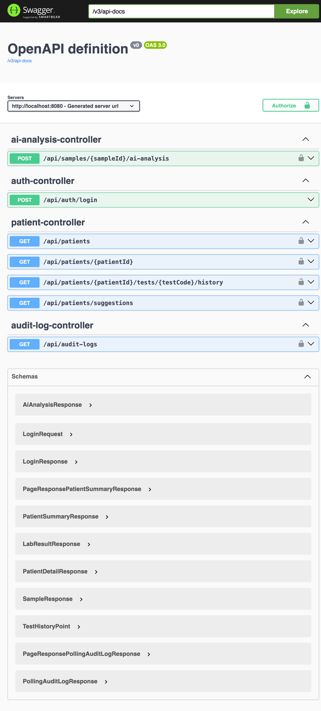

---

## 10. Testleri çalıştırma

```bash
# Backend — 54 test. Integration testleri Testcontainers ile gerçek PostgreSQL başlatır,
# bu yüzden Docker çalışmalıdır. Gerçek Ollama veya mock servis GEREKMEZ (MockWebServer).
cd backend-api && ./mvnw test

# Mock servis — 10 test
cd mock-lab-service && ./mvnw test

# Frontend — 14 test + lint + production build + güvenlik denetimi
cd frontend && npm ci && npm test && npm run lint && npm run build && npm audit --audit-level=high
```

Windows PowerShell'de Maven testleri için wrapper'ın `.cmd` sürümünü kullanın:

```powershell
cd backend-api
.\mvnw.cmd test

cd ..\mock-lab-service
.\mvnw.cmd test

cd ..\frontend
npm ci
npm test
npm run lint
npm run build
npm audit --audit-level=high
```


---

## 11. Durdurma ve veriyi sıfırlama

```bash
docker compose -f docker-compose.full.yml down       # full stack'i durdur
docker compose -f docker-compose.full.yml down -v    # verisiyle birlikte tamamen sil
docker compose down -v                                # geliştirme PostgreSQL'ini sıfırla
```

---

## 12. Sorun giderme

### AI analizi alınamıyor
```bash
curl http://localhost:11434/api/tags     # Ollama ayakta mı?
ollama list                               # gemma2:9b var mı?
ollama pull gemma2:9b                      # yoksa indir
```

Windows'ta Ollama uygulamasının sistem tepsisinde çalıştığını kontrol edin. PowerShell'de:

```powershell
Invoke-RestMethod http://localhost:11434/api/tags
docker compose -f docker-compose.full.yml logs backend-api
```

Ollama host'ta yanıt veriyor fakat backend erişemiyorsa Docker Desktop'ın Linux containers
modunda ve WSL 2 backend ile çalıştığını doğrulayın.

Sistem AI olmadan da çalışır; yalnızca AI paneli kontrollü hata gösterir.

### Frontend ilk açılışta kısa süre 502 gösteriyor
Backend Flyway + Spring context'i tamamlanmadan nginx proxy istek almış olabilir. `curl
http://localhost:8080/actuator/health` `UP` dönene kadar bekleyip sayfayı yenileyin.

### Port zaten kullanılıyor
Compose portları parametriktir:
```bash
FRONTEND_PORT=15173 BACKEND_PORT=18080 MOCK_LAB_PORT=18081 \
docker compose -f docker-compose.full.yml up --build
```

### Backend PostgreSQL'e bağlanamıyor
```bash
docker compose ps
docker compose logs postgres
```
Lokal geliştirmede backend `localhost:5432`, full compose içinde `postgres:5432` kullanır.

### Testcontainers Docker bulamıyor
`docker info` ile Docker'ın çalıştığını doğrulayın, sonra backend testini tekrar çalıştırın.
