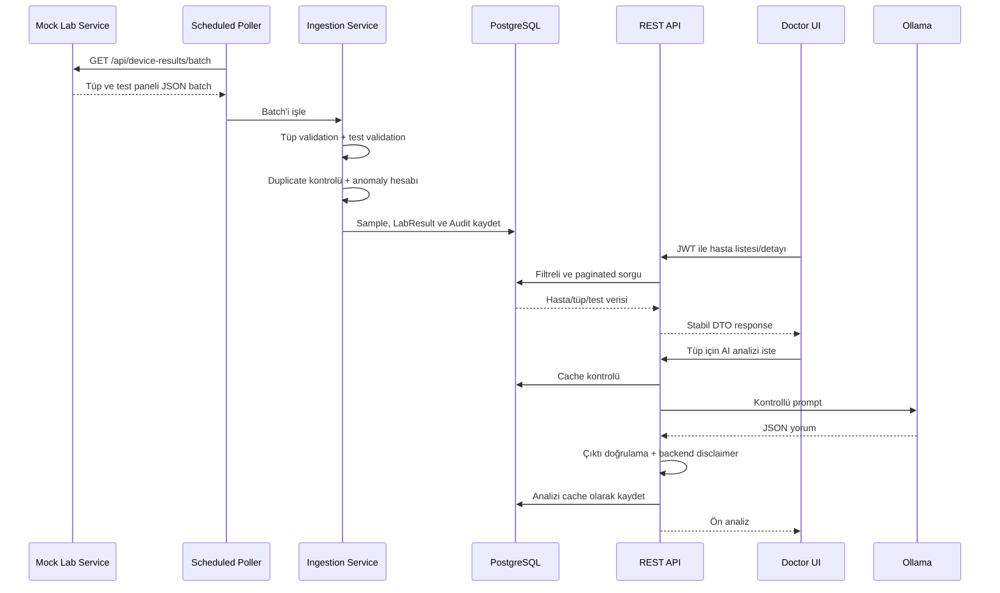

# Teknik Tasarım ve Karar Savunması

Bu belge, sistemin yalnızca ne yaptığını değil, neden bu şekilde tasarlandığını ve hangi
trade-off'ların bilinçli olarak kabul edildiğini açıklar.

## Tasarım Hedefleri

Benim önceliklerim şunlardı:

1. Case'teki bütün zorunlu parçaları uçtan uca çalışan tek bir akışta birleştirmek.
2. Normal akış kadar bozuk veri ve dış servis kesintilerini de görünür ve test edilebilir yapmak.
3. LLM'i sistemin karar vericisi değil, kontrollü yorumlayıcısı olarak konumlandırmak.
4. Beş günlük case kapsamında gereksiz production karmaşıklığından kaçınmak.
5. Her önemli kararı kod, test ve dokümanla savunabilir hale getirmek.

## Uçtan Uca Veri Akışı



## Domain Modeli: Hasta -> Tüp -> Test

İlk bakışta her laboratuvar sonucunu bağımsız kayıt olarak modellemek daha kolay görünür. Ancak gerçek
iş akışında aynı kan alımı/numune bir test paneli taşır. Bu nedenle domain'i üç seviyeye ayırdım:

```text
Patient (API rollup)
  -> Sample / Tube
       -> LabResult[]
```

Bu modelin sonuçları:

- `sampleId`, idempotency anahtarı olarak doğal bir sınır oluşturur.
- Aynı tüpteki testler birlikte görüntülenebilir.
- AI analizi tek test yerine panel bağlamını yorumlayabilir.
- Tüp seviyesinde ölçüm zamanı ve cihaz bilgisi tekrar edilmez.
- Tüp güvenilir değilse bütün panel reddedilebilir; tek test bozuksa yalnızca o test `INVALID` olur.

Alternatif, her testi bağımsız satır ve bağımsız AI isteği yapmak olurdu. Bu daha basit görünse de
panel bağlamını kaybettirir ve aynı numuneye ait metadata'yı tekrarlar.

## Backend Katmanları

```text
Controller -> Service -> Repository -> PostgreSQL
                   |
                   +-> DeviceClient / OllamaClient
```

- **Controller:** HTTP parametrelerini ve DTO response'u yönetir; iş kuralı içermez.
- **Service:** Use-case akışını ve transaction sınırını yönetir.
- **Repository:** JPA üzerinden veri erişimini soyutlar.
- **Domain/entity:** Tüp, test, audit ve AI analizinin kalıcı modelidir.
- **DTO:** Dış servis ve frontend sözleşmelerini entity'lerden ayırır.

Entity'leri doğrudan REST response olarak döndürmedim. Böylece lazy-loading, iç alanların sızması ve
veritabanı modelindeki değişikliklerin API sözleşmesini istemeden bozması engellenir. Pagination için
de Spring'in dahili `PageImpl` JSON'una güvenmek yerine stabil `PageResponse` DTO'su kullanılır.

## Polling Tasarımı

### Seçilen yaklaşım

Backend, mock cihazı `@Scheduled(fixedDelay)` ile periyodik olarak çağırır.

### Neden?

`fixedDelay`, bir cycle bittikten sonra beklemeye başlar. Cihaz veya veritabanı yavaşsa iki ingestion
cycle'ı aynı anda çalışmaz. `fixedRate` seçilseydi uzun süren cycle'lar üst üste binebilirdi.

### Hata davranışı

- Cihaz `503` döndürürse veya timeout olursa backend çökmez.
- Başarısız cycle audit log'a yazılır.
- Scheduler sonraki cycle'da yeniden dener.
- Device client timeout'u config üzerinden yönetilir.

### Production alternatifi

Tek instance demo için Spring scheduler yeterlidir. Multi-instance ortamda distributed lock veya
harici scheduler/queue gerekir. ShedLock bu case'in açık kapsam dışı maddelerindendir.

## Validation Stratejisi

Validation'ı iki seviyeye ayırdım.

### Tüp seviyesi

Tüp kimliği, hasta kimliği, ölçüm zamanı ve cihaz kimliği olmadan kayıt anlamlı değildir. Ayrıca
gelecekteki veya 180 günden eski ölçüm zamanı bütün tüpü güvenilmez yapar. Böyle bir tüp saklanmaz,
fakat audit log'da reddedilme sebebi görünür.

### Test seviyesi

Tüp güvenilir olduğu halde tek bir testin değeri, birimi veya referans sınırı bozuk olabilir. Bu test
tamamen düşürülmez; `INVALID` olarak saklanır.

Bu ayrımın nedeni gözlemlenebilirliktir:

- “Cihaz bu testi hiç göndermedi.”
- “Test geldi fakat kullanılamaz durumdaydı.”

Bu iki durum doktor ve operasyon ekibi için aynı değildir.

Production ortamında bilinen birimler ve klinik kurallar kod içindeki küçük listeler yerine version'lı
bir katalog/config servisi üzerinden yönetilmelidir.

## Anomaly Sınıflandırması

Sınıflandırma LLM'den bağımsız, deterministic Java koduyla yapılır:

```text
NORMAL   min <= value <= max
LOW      value < min
HIGH     value > max
CRITICAL value < min - factor * width
         veya value > max + factor * width
INVALID  değer/birim/referans güvenilir değil
```

Varsayılan `factor=0.5` değerini açıklanabilir bir demo heuristiği olarak seçtim. Bunun klinik gerçek
olmadığını açıkça belirtiyorum. Production'da her test için klinisyen onaylı panic değerleri gerekir.

LLM'e anomaly hesabı yaptırmama nedenim:

- Aynı input için aynı sonucu garanti etmek.
- İş kuralını test edebilmek.
- Model halüsinasyonunun klinik durum etiketini değiştirmesini önlemek.

## Idempotency ve Duplicate Yönetimi

`sampleId` veritabanında unique constraint ile korunur.

Ingestion sırasında:

1. Aynı batch içindeki tekrarlar bir set ile bulunur.
2. Daha önce saklanmış tüpler repository kontrolüyle atlanır.
3. Veritabanı unique constraint'i son güvenlik katmanı olarak kalır.
4. Duplicate sayısı ve detayları audit log'a yazılır.

Ön kontrolün nedeni, PostgreSQL unique constraint ihlalinin mevcut transaction'ı abort etmesidir.
Constraint exception'ını aynı transaction içinde yakalayıp devam etmek güvenilir değildir.

Single-instance scheduler nedeniyle DB seviyesinde eşzamanlı yarış bu demo için beklenmez. Production
multi-instance ingestion'da ayrı transaction/upsert/idempotency inbox yaklaşımı değerlendirilebilir.

## Audit ve Loglama

İki farklı log ihtiyacını ayırdım:

- **Uygulama logları:** Çalışma zamanı teşhisi için stdout/logging.
- **Kalıcı audit kayıtları:** Her polling cycle için fetched, valid, invalid, duplicate sayıları ve
  hata detayları.

Audit kaydı veriyle aynı transaction bağlamında yazılır. Böylece başarılı görünen fakat verisi commit
olmayan cycle oluşmaz. Device erişim hataları ise ingestion transaction'ı başlamadan ayrıca audit edilir.

## Auth ve Güvenlik Modeli

### Seçilen yaklaşım

- Flyway ile seed edilen tek demo doktor
- BCrypt parola hash'i
- Stateless ve süreli JWT
- Spring Security filter chain
- RFC 7807 `ProblemDetail` hata cevapları
- Frontend'de memory-only token

### Terminoloji ve sınırlar

- BCrypt encryption değildir; tek yönlü parola hash'idir.
- JWT imzalıdır fakat şifreli değildir; payload içine hassas veri konmaz.
- Demo localhost'ta HTTP kullanır; production'da TLS zorunludur.
- Docker profilindeki JWT secret demo kolaylığı içindir; production'da secret manager gerekir.

### Neden public register yok?

Hastane sisteminde doktor hesabı self-service kayıtla açılmamalıdır. Case yalnızca doktor login'i
istediği için public register eklemek güvenlik riski ve kapsam genişlemesi olurdu.

### Neden token memory'de?

Token'ı `localStorage` içinde kalıcı bırakmak yerine page lifecycle boyunca memory'de tutuyorum.
Sayfa yenilemede yeniden login gerekmesi UX maliyetidir; sağlık verisi demosunda daha dar güvenlik
yüzeyini tercih ettim. Production için BFF veya güvenli HttpOnly cookie/session tasarımı değerlendirilir.

## LLM Tasarımı ve Güvenlik Sınırları

LLM'i klinik karar motoru değil, doktora yönelik kontrollü yorum katmanı olarak tasarladım.

### Backend'in belirlediği gerçekler

- Test değerleri ve referans aralıkları
- Deterministic anomaly durumları
- `flaggedTests`
- Zorunlu disclaimer

### Modelden alınan alanlar

- Türkçe panel özeti
- Genel ve reçetesiz takip önerileri

### Koruma katmanları

1. Backend bütün paneli deterministic metne dönüştürür.
2. Prompt durumları kesin kabul etmesini ve veri uydurmamasını söyler.
3. Ollama `temperature=0`, `stream=false`, `format=json` ile çağrılır.
4. Model JSON'u parse edilir; boş özet ve bozuk çıktı reddedilir.
5. Modelin `flaggedTests` çıktısı kullanılmaz.
6. Disclaimer modelden beklenmez, backend ekler.
7. Timeout ve bağlantı hataları `503 AI analysis unavailable` cevabına dönüşür.
8. Aynı sample/model/promptVersion analizi tekrar çağrılmaz, DB cache kullanılır.

Raw WebClient seçtim; tek provider ve tek endpoint için Spring AI gibi daha büyük bir abstraction
eklemek gereksizdi. Production'da gözlemlenebilirlik, prompt evaluation, PHI politikaları ve asenkron
queue eklenmelidir.

## Frontend UX Kararları

- Hasta arama önerileri 250 ms debounce ile gelir; büyük liste her tuşta filtrelenmez.
- Öneri seçmek arama değerini doldurur, sorgu kullanıcı `Hastaları getir` dediğinde uygulanır.
- Hasta numarası ve test kodu sorguları case-insensitive'tir.
- Kritik satırlar yalnızca renkle değil, metin rozetiyle de ayrılır.
- Hasta detayında anormal testler önce gösterilir.
- Loading, error, empty ve success durumları görünürdür.
- Hasta listesi 10 saniyede bir yenilenir; demo için WebSocket yerine daha sade bir yaklaşım seçilmiştir.
- Session bittiğinde TanStack Query cache temizlenir; önceki doktor verisi yeni session'a taşınmaz.

## Docker ve Çalıştırma Modeli

İki compose dosyasını bilinçli olarak ayırdım:

- `docker-compose.yml`: Geliştirme için yalnızca PostgreSQL; uygulamalar host'ta hızlı reload ile çalışır.
- `docker-compose.full.yml`: Teslim için backend, mock, frontend ve PostgreSQL'i tek komutla başlatır.

Ollama container'a alınmaz; büyük model lifecycle'ı host üzerinde kalır. Container backend,
Linux desteği dahil `host.docker.internal` üzerinden Ollama'ya erişir. Frontend nginx, `/api`
isteklerini backend'e proxy ederek Docker ortamında same-origin trafik sağlar.

## Bilinçli Olarak Yapılmayanlar

| Konu | Bu case'te neden yok? | Production yaklaşımı |
|---|---|---|
| Refresh token rotation | Açıkça kapsam dışı | Rotation + revocation |
| Ek roller/RBAC | Tek doktor akışı yeterli | Identity provider + policy |
| WebSocket | 10 saniyelik polling yeterli | Event-driven push |
| Multi-model LLM | Açıkça kapsam dışı | Model routing/evaluation |
| Asenkron AI | Demo için senkron akış anlaşılır | Queue + worker |
| Scheduler locking | Single instance demo | ShedLock/distributed scheduler |
| Kubernetes | Tek node demo için değer katmıyor | İhtiyaca göre orchestration |
| Klinik panic katalogu | Alan uzmanı verisi yok | Clinician-owned versioned config |

