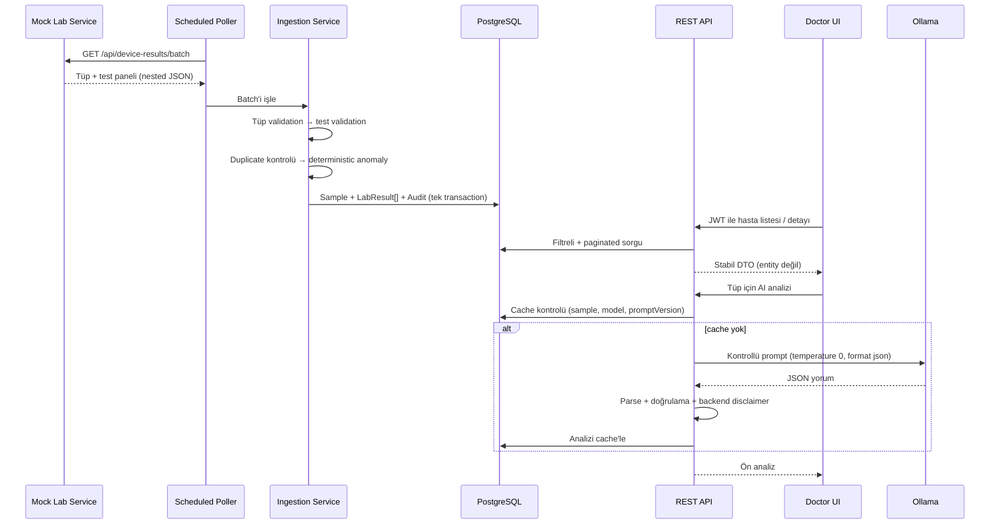
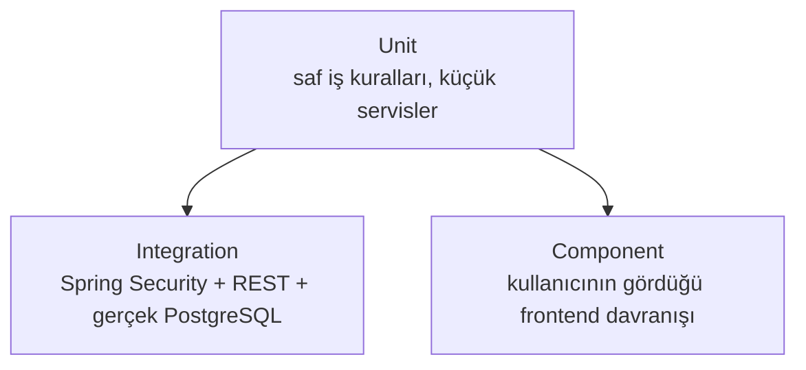

# Teknik Tasarım ve Karar Savunması

Bu belge, sistemin **ne yaptığını** değil, **neden bu şekilde tasarlandığını** ve hangi
trade-off'ların bilinçli olarak kabul edildiğini açıklar. Her bölümde önce seçilen yaklaşım, sonra
reddedilen alternatif, en sonda **production'da ne yapardım** yer alır.

- Hızlı bakış → [README](../README.md)
- Kurulum ve görselli demo → [Kurulum ve Demo Kılavuzu](kurulum-ve-demo.md)

---

## İçindekiler

1. [Tasarım hedefleri](#1-tasarım-hedefleri)
2. [Uçtan uca veri akışı](#2-uçtan-uca-veri-akışı)
3. [Domain modeli: Hasta → Tüp → Test](#3-domain-modeli-hasta--tüp--test)
4. [Katmanlı mimari ve API sözleşmesi](#4-katmanlı-mimari-ve-api-sözleşmesi)
5. [Polling tasarımı](#5-polling-tasarımı)
6. [Validation stratejisi](#6-validation-stratejisi)
7. [Anomali sınıflandırması](#7-anomali-sınıflandırması)
8. [Idempotency ve duplicate yönetimi](#8-idempotency-ve-duplicate-yönetimi)
9. [Audit ve loglama](#9-audit-ve-loglama)
10. [Auth ve güvenlik modeli](#10-auth-ve-güvenlik-modeli)
11. [LLM tasarımı ve güvenlik sınırları](#11-llm-tasarımı-ve-güvenlik-sınırları)
12. [Frontend UX kararları](#12-frontend-ux-kararları)
13. [Docker ve çalıştırma modeli](#13-docker-ve-çalıştırma-modeli)
14. [Test stratejisi ve failure-mode matrisi](#14-test-stratejisi-ve-failure-mode-matrisi)
15. [Bilinçli olarak yapılmayanlar](#15-bilinçli-olarak-yapılmayanlar)
16. [Bağımsız değerlendirme sonrası sertleştirmeler](#16-bağımsız-değerlendirme-sonrası-sertleştirmeler)

---

## 1. Tasarım hedefleri

Öncelik sırasıyla:

1. Case'in bütün zorunlu parçalarını **uçtan uca çalışan tek bir akışta** birleştirmek.
2. Normal akış kadar **bozuk veri ve dış servis kesintilerini** de görünür ve test edilebilir kılmak.
3. LLM'i sistemin **karar vericisi değil, kontrollü yorumlayıcısı** olarak konumlandırmak.
4. Beş günlük bir case kapsamında **gereksiz production karmaşıklığından** kaçınmak.
5. Her önemli kararı kod, test ve dokümanla **savunulabilir** hale getirmek.

---

## 2. Uçtan uca veri akışı



---

## 3. Domain modeli: Hasta → Tüp → Test

### Seçilen model

```text
Patient            (sorgu zamanı rollup; ayrı tablo değil)
  └─ Sample/Tube   (sampleId · patientId · measuredAt · deviceId)
       └─ LabResult[]   (testCode · value · unit · referans · anomalyStatus)
```

İki tablo: `sample` (tüp) ve `lab_result` (her test), `lab_result.sample_fk → sample.id` ilişkisiyle.
JPA tarafında `Sample @OneToMany LabResult`, `LabResult @ManyToOne Sample`.

### Neden?

Gerçek bir lab analizöründe bir **tüp** işlenir ve bir **panel** üretir: tek hasta, tek `sampleId`,
tek ölçüm zamanı, birden çok test. Bunun sonuçları:

- `sampleId` doğal bir **idempotency sınırı** olur.
- Aynı numuneye ait testler birlikte görüntülenir; **AI tek değeri değil paneli** yorumlar.
- Ölçüm zamanı ve cihaz bilgisi her testte **tekrar etmez**.
- Tüpün metadata'sı güvenilmezse **bütün panel reddedilebilir**; tek test bozuksa yalnızca o test
  `INVALID` olur.

### Reddedilen alternatif

"Her test = bağımsız satır + bağımsız AI isteği." Daha basit görünür ama panel bağlamını kaybettirir,
aynı numunenin metadata'sını her satırda tekrarlar ve idempotency'yi zayıflatır.

> **Not:** `Patient` ayrı bir tablo değildir; hasta listesi `sample`/`lab_result` üzerinde sorgu
> zamanı **GROUP BY ile rollup**'tır. Bu kapsamda hasta için ayrı bir kimlik tablosu gereksiz olurdu;
> production'da hasta master-data ayrı bir bounded context olurdu.

---

## 4. Katmanlı mimari ve API sözleşmesi

```text
Controller → Service → Repository → PostgreSQL
                  └─→ DeviceClient / OllamaClient (dış HTTP, WebClient)
```

- **Controller:** yalnızca HTTP ve DTO; iş kuralı içermez.
- **Service:** use-case akışı ve **transaction sınırı**.
- **Repository:** Spring Data JPA ile veri erişimi.
- **Domain/DTO ayrımı:** entity'ler **asla** REST response olarak dönmez.

### Neden entity değil DTO?

Entity döndürmek üç sorun getirir: lazy-loading'in serialization sırasında patlaması, iç alanların
sızması, ve DB şemasındaki bir değişikliğin API sözleşmesini sessizce bozması. Ayrıca pagination'da
Spring'in `PageImpl` JSON'u sözleşme garantisi vermez (boot loglarında da uyarılır); bu yüzden stabil
bir **`PageResponse`** DTO'su kullanılır.

### `open-in-view: false`

Bilinçli olarak kapatıldı. Açık olsaydı (Spring varsayılanı) view katmanına kadar bir DB Session
açık kalır ve **gizli N+1 / lazy-init** sorunlarını maskelerdi. Kapalı tutmak, ilişkilerin
**servis katmanında bilinçli** (örn. `JOIN FETCH`) çözülmesini zorunlu kılar.

---

## 5. Polling tasarımı

### Seçilen yaklaşım

Backend mock cihazı varsayılan olarak **`@Scheduled(fixedDelay = 30s)`** ile çağırır
(`lab.polling.fixed-delay-ms`). Normal mock batch 1-2 tüp üretir; full Docker çalıştırmasında
`POLLING_DELAY_MS` ile demo hızı değiştirilebilir.

### Neden `fixedDelay`, `fixedRate` değil?

`fixedDelay` bir cycle **bittikten sonra** beklemeye başlar. Cihaz veya DB yavaşsa iki ingestion
cycle'ı **üst üste binmez**. `fixedRate` olsaydı uzun süren cycle'lar çakışıp aynı veriyi iki kez
işleme riski doğururdu.

### Hata davranışı

- Cihaz `503` döndürür veya timeout (`5s`) olursa **backend çökmez**.
- Başarısız cycle **audit log'a** yazılır.
- Scheduler bir sonraki cycle'da yeniden dener.

### Production

Tek-instance için Spring scheduler yeterlidir. Multi-instance'ta aynı cycle'ın birden çok kez
çalışmasını önlemek için **ShedLock** veya harici bir scheduler/queue gerekir (kapsam dışı).

---

## 6. Validation stratejisi

Validation iki seviyeye ayrıldı: **tüp** ve **test**.

### Tüp seviyesi (SampleValidator)

`sampleId`, `patientId`, `measuredAt`, `deviceId` olmadan kayıt anlamsızdır. Ayrıca **gelecekteki**
veya **180 günden eski** bir ölçüm zamanı bütün tüpü güvenilmez yapar → tüp saklanmaz, audit'e
reddedilme sebebiyle yazılır. **Gerekçe: güvenilmez tüp zamanı, güvenilmez sonuç demektir.**

### Test seviyesi (TestResultValidator)

Tüp güvenilir olsa bile tek bir testin değeri/birimi/sınırı bozuk olabilir. Bu test **düşürülmez,
`INVALID` saklanır.**

### Neden bozuk test silinmiyor?

Çünkü iki durum doktor için **farklı bilgidir**:

- "Cihaz bu testi hiç göndermedi."
- "Test geldi ama kullanılamaz durumdaydı."

Silmek bu ayrımı yok eder. Saklamak **gözlemlenebilirlik** sağlar.

### Production

Bilinen birimler ve klinik kurallar koddaki küçük listeler yerine **versiyonlanmış bir
katalog/config servisi** üzerinden yönetilmelidir.

---

## 7. Anomali sınıflandırması

Sınıflandırma **LLM'den tamamen bağımsız, deterministic Java** ile yapılır:

```text
NORMAL    min ≤ value ≤ max
LOW       value < min
HIGH      value > max
CRITICAL  value < min − factor·(max−min)   veya   value > max + factor·(max−min)
INVALID   değer/birim/referans güvenilir değil
```

Varsayılan `factor = 0.5`, `lab.anomaly.critical-factor` ile dışarıdan yönetilir (kodda sabit yok).

> Bu **açıklanabilir bir demo heuristiğidir, klinik gerçek değildir.** Production'da her test için
> klinisyen onaylı panik değerleri gerekir.

### Neden anomaliyi LLM hesaplamıyor?

- **Determinizm:** aynı girdi → her zaman aynı sonuç.
- **Test edilebilirlik:** iş kuralı saf birim testiyle doğrulanabilir.
- **Güvenlik:** model halüsinasyonu klinik durum etiketini **değiştiremez**.

---

## 8. Idempotency ve duplicate yönetimi

`sample.sampleId` veritabanında **UNIQUE**. Tüp içinde `(sample_fk, test_code)` de UNIQUE.
Ingestion sırasında (kod: `LabResultIngestionService`):

1. Aynı batch içindeki tekrarlar bir `Set` ile yakalanır (`seenInBatch`).
2. Daha önce saklanmış tüpler `existsBySampleId` ile **önceden** atlanır.
3. DB UNIQUE constraint'i **son güvenlik katmanı** olarak kalır.
4. Tüp içinde tekrar eden `testCode` → ilki tutulur, ikincisi reddedilir.
5. Duplicate sayısı ve sebebi audit'e yazılır; kayıt **eklenmez**.

### Neden DB exception'ına güvenmek yerine ön-kontrol?

PostgreSQL'de bir UNIQUE ihlali **mevcut transaction'ı abort eder**; aynı transaction içinde
exception'ı yakalayıp devam etmek güvenilir değildir. Ön-kontrol bu yüzden birincil savunmadır;
DB constraint ise yarış durumlarına karşı **emniyet kemeri**dir.

### Production

Single-instance scheduler'da DB seviyesinde gerçek yarış beklenmez. Multi-instance ingestion'da
ayrı-transaction yaklaşımı, **upsert (`ON CONFLICT`)** veya bir **idempotency inbox** değerlendirilir.

---

## 9. Audit ve loglama

İki ayrı log ihtiyacı bilinçli olarak ayrıldı:

- **Uygulama logları (stdout):** runtime teşhisi.
- **Kalıcı audit kayıtları (`polling_audit_log`):** her cycle için fetched / valid / invalid /
  duplicate sayıları + detaylar.

Audit kaydı **veriyle aynı transaction** bağlamında yazılır; böylece "başarılı göründü ama verisi
commit olmadı" durumu oluşmaz. Cihaz erişim hataları ise ingestion transaction'ı başlamadan ayrıca
audit edilir.

> **Panel modelinde sayıların anlamı:** `fetched = tüp sayısı`, `valid/invalid = test sayısı`,
> `duplicate = tüp sayısı`. (Kolon adları geriye dönük uyumluluk için değişmedi.)

---

## 10. Auth ve güvenlik modeli

### Seçilen yaklaşım

Flyway ile seed edilen **tek demo doktor**, **BCrypt** parola hash'i, **stateless + süreli JWT**
(60 dk, `lab.jwt.expiry-minutes`), Spring Security filter chain, RFC 7807 **`ProblemDetail`** hata
cevapları, frontend'de **memory-only token**.

### Terminoloji (mülakat hassasiyeti)

- **BCrypt encryption değildir**; tek yönlü bir parola hash'idir ve salt'ı kendi içinde taşır.
- **JWT imzalıdır ama şifreli değildir**; bu yüzden payload'a hassas veri konmaz.
- Demo localhost'ta **HTTP** kullanır; production'da TLS zorunludur.
- Docker profilindeki JWT secret demo kolaylığıdır; production'da **secret manager** gerekir.

### Neden public register yok?

Hastane sisteminde doktor hesabı **self-service kayıtla açılmaz**, admin tarafından provision edilir.
Case yalnızca login istediği için register eklemek hem güvenlik riski hem kapsam genişlemesi olurdu.

### Neden token memory'de, localStorage'da değil?

Token'ı kalıcı storage'a yazmak yerine sayfa yaşam döngüsü boyunca memory'de tutuyorum. Sayfa
yenilemede yeniden login gerekmesi bir UX maliyetidir; sağlık verisi demosunda **daha dar saldırı
yüzeyini** (XSS ile token sızması riskini azaltmayı) tercih ettim. Production için **BFF** veya
güvenli **HttpOnly cookie/session** değerlendirilir.

---

## 11. LLM tasarımı ve güvenlik sınırları

LLM, klinik karar motoru değil, doktora yönelik **kontrollü bir yorum katmanı**dır.

### Backend'in belirlediği (model'e bırakılmayan) gerçekler

- Test değerleri ve referans aralıkları
- Deterministic anomali durumları
- **`flaggedTests`** — kodda `sample.getTests()` üzerinden, **backend durumlarından** üretilir
- Zorunlu **disclaimer** — sabit bir backend constant'tır

### Model'den alınan alanlar

- Panelin Türkçe özeti
- Genel ve **reçetesiz** takip önerileri

### Kodla uygulanan koruma sınırları

1. Backend bütün paneli **deterministic metne** dönüştürür (`AnomalySummaryBuilder`).
2. Cihazdan gelen hasta/numune kimlikleri, test adı ve birim gibi **tüm metin alanları** prompt'a
   eklenmeden önce yapısal karakterlerden temizlenir.
3. Prompt, modele durumları **kesin kabul et, yeniden hesaplama, veri uydurma** der.
4. Ollama `temperature = 0`, `stream = false`, `format = json` ile çağrılır.
5. Model JSON'u **parse edilir**; boş/bozuk/aşırı büyük çıktı **reddedilir** ve cache'e yazılmaz.
6. Modelin döndürdüğü `flaggedTests` **kullanılmaz**; backend'in listesi kullanılır.
7. Disclaimer modelden beklenmez, **backend Türkçe olarak ekler**.
8. Timeout / bağlantı hatası → kontrollü **`503 AI analysis unavailable`**; sistemin kalanı çalışır.
9. Sonuç `(sample, model, promptVersion)` ile **cache**'lenir; ikinci çağrıda LLM çağrılmaz.

Modelin `summary` ve takip önerileri hâlâ **güvenilmeyen serbest metindir**. Kod; biçim, boyut,
deterministik durumlar, flagged test listesi ve disclaimer'ı zorlar fakat klinik doğruluğu veya
tanı dilini eksiksiz biçimde otomatik kanıtlayamaz. Bu nedenle çıktı ön değerlendirme olarak
sunulur ve doktor incelemesi zorunludur.

AI akışında cache/panel okuması ve analiz kaydı kısa repository transaction'larıdır. Panel
`JOIN FETCH` ile yüklenir; dış Ollama çağrısı beklenirken DB transaction'ı ve bağlantısı açık
tutulmaz.

### Prompt nasıl şekillendi?

Prompt v1'den v4'e, **gerçek hatalı çıktılarla** evrildi (örn. küçük modelin negatif lökositi
sorgulamaması, test adını "beygir hücre sayımı" diye çevirmesi). Bu deney günlüğü ve `qwen2.5:7b`
vs `gemma2:9b` karşılaştırması ayrı bir belgededir → [AI Prompt Deney Günlüğü](ai-prompt-experiments.md).

### Neden raw WebClient (Spring AI değil)?

Tek provider ve tek endpoint için Spring AI gibi büyük bir abstraction **gereksiz karmaşıklık**
olurdu; raw `WebClient` ile timeout ve hata davranışı üzerinde tam kontrol var. Production'da
gözlemlenebilirlik, prompt evaluation, PHI politikaları ve asenkron queue eklenirdi.

---

## 12. Frontend UX kararları

- **Arama önerileri 250 ms debounce** ile gelir; büyük liste her tuşta sorgulanmaz.
- Öneri seçmek arama değerini doldurur; sorgu yalnızca **`Hastaları getir`** ile uygulanır
  (öneri ≠ uygulanan filtre).
- Hasta numarası ve test kodu sorguları **case-insensitive**'dir.
- Kritik satırlar **yalnız renkle değil, metin rozetiyle de** ayrılır (erişilebilirlik).
- Hasta detayında **anormal testler önce** sıralanır (client-side).
- **Loading / error / empty / success** durumlarının hepsi görünürdür; uzun işlemler **toast** ile
  bildirilir; hatalar **retry** edilebilir.
- Liste **10 sn'de bir** yenilenir (TanStack Query); demo için WebSocket yerine sade bir yaklaşım.
- **Sunucu durumu TanStack Query ile** yönetilir (cache, `keepPreviousData`, retry); elle state
  tutmaktan daha sağlam ve daha az hata yüzeyli.
- Session bittiğinde **query cache temizlenir**; önceki doktorun verisi yeni session'a taşınmaz.

---

## 13. Docker ve çalıştırma modeli

İki compose dosyası bilinçli olarak ayrıldı:

- **`docker-compose.yml`** → geliştirme: yalnızca PostgreSQL; uygulamalar host'ta hızlı reload ile.
- **`docker-compose.full.yml`** → teslim: backend, mock, frontend, PostgreSQL tek komutla.

**Ollama container'a alınmaz**: büyük model lifecycle'ı host'ta kalır. Container'lar Ollama'ya
`host.docker.internal` üzerinden erişir (Linux'ta full compose `host-gateway` mapping'ini ekler).
Frontend nginx, `/api` isteklerini backend'e proxy ederek Docker ortamında **same-origin** trafik
sağlar (CORS yükü olmadan). nginx'in AI isteği için okuma/yazma timeout'u **70 saniye**, backend'in
Ollama timeout'u **60 saniyedir**; böylece proxy önce kesmek yerine backend'in kontrollü `503`
cevabını kullanıcıya ulaştırabilir.

Frontend imajı **multi-stage** build edilir (Vite build → nginx ile statik serve); API base URL
build argümanıyla **konfigüre edilebilir**.

---

## 14. Test stratejisi ve failure-mode matrisi

Test sayısını tek başına kalite kanıtı saymıyorum; önemli olan testlerin **kritik failure
mode'ları** kapsamasıdır. Güncel: **backend 46 · mock 10 · frontend 14**, tümü yeşil.



- **Integration:** PostgreSQL **Testcontainers** ile gerçek motor olarak başlar — Flyway, UNIQUE
  constraint'ler ve PostgreSQL'e özgü sorgular **H2 ile taklit edilmez**.
- **Dış servisler:** mock cihaz ve Ollama **MockWebServer** ile izole edilir; test paketi gerçek
  Ollama/mock **gerektirmez** (CI'da model indirmeye gerek yok).
- **Frontend:** Testing Library ile davranış testi (implementasyon detayı değil).

### Failure-mode matrisi

| Senaryo | Beklenen davranış | Kanıtlayan test |
|---|---|---|
| Bozuk değer (missing-field) | Güvenilir tüpte test `INVALID` saklanır | `LabResultIngestionServiceTest`, `BackendApiIntegrationTest` |
| Geçersiz birim | Test `INVALID`, sebep audit'te | `LabResultIngestionServiceTest` |
| Stale/future tüp | **Tüm tüp** reddedilir | `LabResultIngestionServiceTest` |
| Duplicate tüp/test | Eklenmez, duplicate sayılır | `LabResultIngestionServiceTest` |
| Cihaz `503`/kesinti | Backend çökmez, audit edilir, tekrar dener | `LabResultPollerTest` |
| Cihaz timeout | İstek yapılandırılan sürede kesilir | `DeviceClientTest` |
| Ollama timeout/kesinti | Kontrollü `503`, analiz **cache'e yazılmaz** | `AiAnalysisServiceTest` |
| Bozuk/boş LLM JSON | Çıktı reddedilir | `AiAnalysisServiceTest` |
| LLM sahte flaggedTest üretir | Model iddiası yok sayılır, backend listesi kullanılır | `AiAnalysisServiceTest` |
| Prompt injection (dış cihaz metin alanları) | Sahte prompt satırı enjekte edilemez | `AnomalySummaryBuilderTest` |
| Aşırı büyük LLM özeti | Çıktı reddedilir ve cache'e yazılmaz | `AiAnalysisServiceTest` |
| İlk AI yanıtında zaman bilgisi | `createdAt` ilk response'ta doludur | `AiAnalysisServiceTest`, `BackendApiIntegrationTest` |
| Mock servis yeniden başlatılır | Normal akış sample ID'leri önceki run ile çakışmaz | `DeviceResultFactoryTest` |
| JWT süresi dolmuş / kurcalanmış / sahte imza | Reddedilir | `JwtServiceTest` |
| Yetkisiz erişim | Korumalı endpoint `401 ProblemDetail` | `BackendApiIntegrationTest` |
| Hatalı login | Kullanıcı varlığı sızdırmadan `401` | `LoginPage.test`, `GlobalExceptionHandlerTest` |
| Geçersiz enum/tarih param | `500` değil, tutarlı `400 ProblemDetail` | `BackendApiIntegrationTest` |
| Aşırı page size | Backend `100` ile sınırlar | `BackendApiIntegrationTest` |
| AI frontend durumları | Loading / success / error görünür | `AiAnalysisPanel.test` |

### Kalan riskler

- Component testleri tam tarayıcı E2E'sini kapsamaz; production'da Playwright/Cypress eklenir.
- LLM testi **şema/güvenlik sınırlarını** doğrular; klinik doğruluk için alan uzmanı + versiyonlu
  evaluation dataset gerekir.
- Modelin serbest metninde tanı/reçete dilini eksiksiz yakalayan bir semantik filtre yoktur;
  backend'in zorladığı alanlar ve doktor incelemesi asıl güvenlik sınırıdır.
- Multi-instance ingestion yarışı single-node kapsamında test edilmedi.

---

## 15. Bilinçli olarak yapılmayanlar

| Konu | Bu kapsamda neden yok? | Production yaklaşımı |
|---|---|---|
| Senkron LLM çağrısı | Demo akışını sade ve izlenebilir tutmak | Queue + worker + job-status |
| Tek global kritik faktör | Açıklanabilir demo kuralı yeterli | Test bazlı klinik panik değerleri |
| Tek `DOCTOR` rolü | Case ek rol istemiyor | Identity provider + RBAC |
| Memory'de JWT | Token'ı tarayıcı storage'ında bırakmamak | BFF veya güvenli HttpOnly cookie/session |
| Tek-instance scheduler | Multi-instance açıkça kapsam dışı | ShedLock / distributed scheduler |
| HTTP (localhost) | Lokal demo | TLS + secret manager + network policy |
| WebSocket / realtime | 10 sn yenileme yeterli | Event-driven push |
| Refresh token rotation | Açıkça kapsam dışı | Rotation + revocation |
| Multi-model LLM | Açıkça kapsam dışı | Model routing / evaluation |
| Kubernetes | Tek-node demo için değer katmaz | İhtiyaca göre orchestration |
| Hasta master-data tablosu | Hasta listesi rollup ile yeterli | Ayrı bounded context |

---

## 16. Bağımsız değerlendirme sonrası sertleştirmeler

Bağımsız teknik jüri incelemesinde bulunan yüksek etkili noktalar şu şekilde düzeltildi:

| Bulgu | Yapılan düzeltme | Neden |
|---|---|---|
| Ollama çağrısı boyunca DB transaction'ı açıktı | Panel `JOIN FETCH` ile okunuyor; servis seviyesindeki transaction kaldırıldı | Yavaş dış servis DB bağlantısını gereksiz yere tutmasın |
| nginx backend'den önce timeout olabilirdi | Proxy timeout'u 70s, backend Ollama timeout'u 60s yapıldı | Kontrollü backend hatası UI'a ulaşsın |
| Prompt temizliği yalnız kimlik alanlarındaydı | Test adı ve birim dahil tüm dış metin alanları temizleniyor | Cihaz metni prompt yapısı enjekte edemesin |
| Mock normal akış ID'leri restart sonrası başa dönüyordu | Sample ID'ye run'a özgü prefix eklendi | Kalıcı DB'de yeni veriler yanlışlıkla duplicate sayılmasın |
| İlk AI response'unda `createdAt` boştu | Entity oluşturulurken zaman atanıyor, DB default'u da korunuyor | İlk ve cache response sözleşmesi tutarlı olsun |
| Model serbest metin kontrolü zayıftı | Özet/takip boyut sınırları eklendi; semantik sınır açıkça dokümante edildi | Savunulabilir güvenlik sınırı kurmak, yanlış tam güvenlik iddiasından kaçınmak |
| Disclaimer İngilizceydi | Backend-enforced disclaimer Türkçeleştirildi | Türkçe arayüz ve ürün dili tutarlı olsun |
