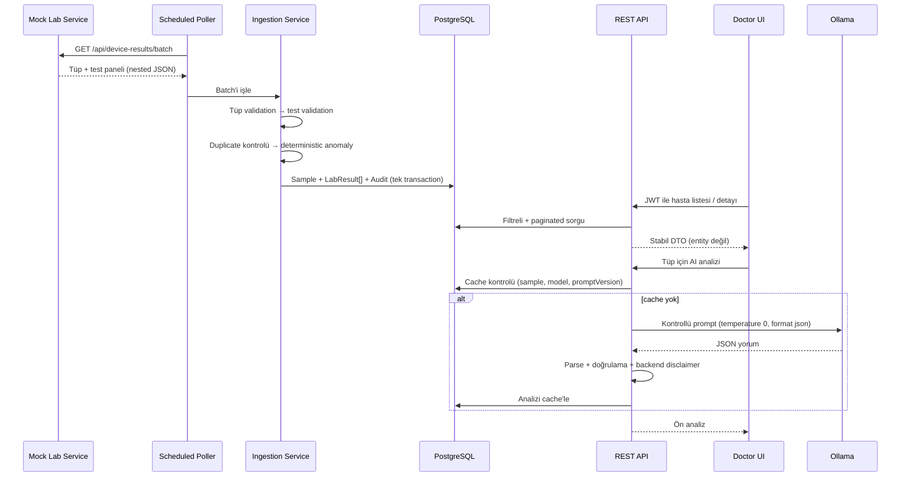
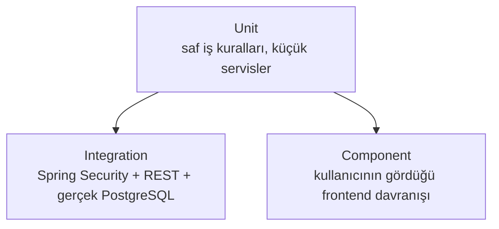

# Teknik Tasarım ve Karar Savunması

Bu belge sistemin ne yaptığını değil, neden bu şekilde tasarlandığını ve hangi trade-off'ların
bilinçli olarak kabul edildiğini anlatıyor. Her bölümde önce seçtiğim yaklaşım, sonra reddettiğim
alternatif, en sonda production'da ne yapardım var.

- Hızlı bakış → [README](../README.md)
- Kurulum ve görselli demo → [Kurulum ve Demo Kılavuzu](kurulum-ve-demo.md)

---

## İçindekiler

1. [Tasarım hedefleri](#1-tasarım-hedefleri)
2. [Uçtan uca veri akışı](#2-uçtan-uca-veri-akışı)
3. [Domain modeli: Hasta → Tüp → Test](#3-domain-modeli-hasta--tüp--test)
4. [Katmanlı mimari ve API sözleşmesi](#4-katmanlı-mimari-ve-api-sözleşmesi)
5. [Polling tasarımı](#5-polling-tasarımı)
6. [Validation stratejisi](#6-validation-stratejisi)
7. [Anomali sınıflandırması](#7-anomali-sınıflandırması)
8. [Idempotency ve duplicate yönetimi](#8-idempotency-ve-duplicate-yönetimi)
9. [Audit ve loglama](#9-audit-ve-loglama)
10. [Auth ve güvenlik modeli](#10-auth-ve-güvenlik-modeli)
11. [LLM tasarımı ve güvenlik sınırları](#11-llm-tasarımı-ve-güvenlik-sınırları)
12. [Frontend UX kararları](#12-frontend-ux-kararları)
13. [Docker ve çalıştırma modeli](#13-docker-ve-çalıştırma-modeli)
14. [Test stratejisi ve failure-mode matrisi](#14-test-stratejisi-ve-failure-mode-matrisi)
15. [Bilinçli olarak yapılmayanlar](#15-bilinçli-olarak-yapılmayanlar)
16. [Bağımsız değerlendirme sonrası sertleştirmeler](#16-bağımsız-değerlendirme-sonrası-sertleştirmeler)

---

## 1. Tasarım hedefleri

Öncelik sırasıyla:

1. Projenin bütün zorunlu parçalarını uçtan uca çalışan tek bir akışta birleştirmek.
2. Normal akış kadar bozuk veriyi ve dış servis kesintilerini de görünür, test edilebilir kılmak.
3. LLM'i sistemin karar vericisi olarak değil, kontrollü bir yorumlayıcı olarak konumlandırmak.
4. Bu kapsamda gereksiz production karmaşıklığından kaçınmak.
5. Her önemli kararı kod, test ve dokümanla savunulabilir hale getirmek.

---

## 2. Uçtan uca veri akışı



---

## 3. Domain modeli: Hasta → Tüp → Test

### Seçilen model

```text
Patient            (sorgu zamanı rollup; ayrı tablo değil)
  └─ Sample/Tube   (sampleId · patientId · measuredAt · deviceId)
       └─ LabResult[]   (testCode · value · unit · referans · anomalyStatus)
```

İki tablo: `sample` (tüp) ve `lab_result` (her test), `lab_result.sample_fk → sample.id` ilişkisiyle.
JPA tarafında `Sample @OneToMany LabResult`, `LabResult @ManyToOne Sample`.

### Neden?

Gerçek bir lab analizörü bir tüpü işler ve bir panel üretir: tek hasta, tek `sampleId`, tek ölçüm
zamanı, birden çok test. Bunun sonuçları:

- `sampleId` doğal bir idempotency sınırı oluyor.
- Aynı numuneye ait testler birlikte görünüyor, böylece AI tek bir değeri değil paneli yorumluyor.
- Ölçüm zamanı ve cihaz bilgisi her testte tekrar etmiyor.
- Tüpün metadata'sı güvenilmezse bütün panel reddedilebilir. Tek bir test bozuksa yalnızca o test
  `INVALID` olur.

### Reddedilen alternatif

"Her test = bağımsız satır + bağımsız AI isteği." Daha basit görünür ama panel bağlamını kaybettirir,
aynı numunenin metadata'sını her satırda tekrarlar ve idempotency'yi zayıflatır.

---

## 4. Katmanlı mimari ve API sözleşmesi

```text
Controller → Service → Repository → PostgreSQL
                  └─→ DeviceClient / OllamaClient (dış HTTP, WebClient)
```

- Controller: yalnızca HTTP ve DTO, iş kuralı içermez.
- Service: use-case akışı ve transaction sınırı.
- Repository: Spring Data JPA ile veri erişimi.
- Domain/DTO ayrımı: entity'ler hiçbir zaman REST response olarak dönmez.

### Neden entity değil DTO?

Entity döndürmenin üç sorunu var: lazy-loading serialization sırasında patlar, iç alanlar sızar ve DB
şemasındaki bir değişiklik API sözleşmesini sessizce bozar. Ayrıca pagination'da Spring'in `PageImpl`
JSON'u bir sözleşme garantisi vermez (boot loglarında bunu kendisi de uyarır). Bu yüzden stabil bir
`PageResponse` DTO'su kullanıyorum.

### `open-in-view: false`

Bilinçli olarak kapattım. Açık olsaydı (Spring varsayılanı) view katmanına kadar bir DB Session açık
kalır ve gizli N+1 ile lazy-init sorunlarını maskelerdi. Kapalı tutmak, ilişkileri servis katmanında
bilinçli olarak (örneğin `JOIN FETCH` ile) çözmeyi zorunlu kılıyor.

---

## 5. Polling tasarımı

### Seçilen yaklaşım

Backend mock cihazı varsayılan olarak `@Scheduled(fixedDelay = 30s)` ile çağırır
(`lab.polling.fixed-delay-ms`). Normal mock batch 1-2 tüp üretir; full Docker çalıştırmasında demo
hızı `POLLING_DELAY_MS` ile değiştirilebilir.

### Neden `fixedDelay`, `fixedRate` değil?

`fixedDelay` bir cycle bittikten sonra beklemeye başlar. Cihaz veya DB yavaşsa iki ingestion cycle'ı
üst üste binmez. `fixedRate` olsaydı uzun süren cycle'lar çakışır ve aynı veriyi iki kez işleme riski
doğardı.

### Hata davranışı

- Cihaz `503` döndürür ya da timeout (`5s`) olursa backend çökmez.
- Başarısız cycle audit log'a yazılır.
- Scheduler bir sonraki cycle'da yeniden dener.

### Production

Tek instance için Spring scheduler yeterli. Multi-instance'ta aynı cycle'ın birden çok kez
çalışmasını önlemek için ShedLock ya da harici bir scheduler/queue gerekir (kapsam dışı).

---

## 6. Validation stratejisi

Validation'ı iki seviyeye ayırdım: tüp ve test.

### Tüp seviyesi (SampleValidator)

`sampleId`, `patientId`, `measuredAt`, `deviceId` olmadan kayıt anlamsız. Ayrıca gelecekteki ya da
180 günden eski bir ölçüm zamanı bütün tüpü güvenilmez yapar. Tüp saklanmaz, reddedilme sebebiyle
birlikte audit'e yazılır. Mantık basit: güvenilmez tüp zamanı, güvenilmez sonuç demek.

### Test seviyesi (TestResultValidator)

Tüp güvenilir olsa bile tek bir testin değeri, birimi ya da sınırı bozuk olabilir. Bu test
düşürülmez, `INVALID` olarak saklanır.

### Neden bozuk test silinmiyor?

Çünkü bu iki durum doktor için farklı bilgi:

- "Cihaz bu testi hiç göndermedi."
- "Test geldi ama kullanılamaz durumdaydı."

Silmek bu ayrımı yok eder. Saklamak gözlemlenebilirlik sağlar.

### Production

Bilinen birimler ve klinik kurallar, koddaki küçük listeler yerine versiyonlu bir katalog/config
servisi üzerinden yönetilmeli.

---

## 7. Anomali sınıflandırması

Sınıflandırma, LLM'den tamamen bağımsız deterministic Java ile yapılır:

```text
NORMAL    min ≤ value ≤ max
LOW       value < min
HIGH      value > max
CRITICAL  value < min − factor·(max−min)   veya   value > max + factor·(max−min)
INVALID   değer/birim/referans güvenilir değil
```

Varsayılan `factor = 0.5`, `lab.anomaly.critical-factor` ile dışarıdan yönetilir (kodda sabit yok).

> Bu açıklanabilir bir demo heuristiği, klinik gerçek değil. Production'da her test için klinisyen
> onaylı panic value'lar gerekir.

### Neden anomaliyi LLM hesaplamıyor?

- Determinizm: aynı girdi her zaman aynı sonucu verir.
- Test edilebilirlik: iş kuralı saf bir birim testiyle doğrulanabilir.
- Güvenlik: model halüsinasyonu klinik durum etiketini değiştiremez.

---

## 8. Idempotency ve duplicate yönetimi

`sample.sampleId` veritabanında UNIQUE. Tüp içinde `(sample_fk, test_code)` de UNIQUE. Ingestion
sırasında (kod: `LabResultIngestionService`):

1. Aynı batch içindeki tekrarlar bir `Set` ile yakalanır (`seenInBatch`).
2. Daha önce saklanmış tüpler `existsBySampleId` ile önceden atlanır.
3. DB UNIQUE constraint'i son güvenlik katmanı olarak kalır.
4. Tüp içinde tekrar eden bir `testCode` görülürse ilki tutulur, ikincisi reddedilir.
5. Duplicate sayısı ve sebebi audit'e yazılır, kayıt eklenmez.

### Neden DB exception'ına güvenmek yerine ön-kontrol?

PostgreSQL'de bir UNIQUE ihlali mevcut transaction'ı abort eder; aynı transaction içinde exception'ı
yakalayıp devam etmek güvenilir değil. Bu yüzden ön-kontrol birincil savunma; DB constraint ise race
condition'lara karşı emniyet kemeri.

### Production

Tek instance'lı scheduler'da DB seviyesinde gerçek bir race condition beklenmez. Multi-instance
ingestion'da ayrı-transaction yaklaşımı, upsert (`ON CONFLICT`) ya da bir idempotency inbox
değerlendirilir.

---

## 9. Audit ve loglama

İki ayrı log ihtiyacını bilinçli olarak ayırdım:

- Uygulama logları (stdout): runtime teşhisi.
- Kalıcı audit kayıtları (`polling_audit_log`): her cycle için fetched / valid / invalid / duplicate
  sayıları ve detayları.

Audit kaydı veriyle aynı transaction bağlamında yazılır; böylece "başarılı göründü ama verisi commit
olmadı" durumu oluşmaz. Cihaz erişim hataları ise ingestion transaction'ı başlamadan, ayrıca audit
edilir.

> Panel modelinde sayıların anlamı: `fetched = tüp sayısı`, `valid/invalid = test sayısı`,
> `duplicate = tüp sayısı`. (Kolon adları geriye dönük uyumluluk için değişmedi.)

---

## 10. Auth ve güvenlik modeli

### Seçilen yaklaşım

Flyway ile seed edilen tek bir demo doktor, BCrypt parola hash'i, stateless ve süreli JWT (60 dk,
`lab.jwt.expiry-minutes`), Spring Security filter chain, RFC 7807 `ProblemDetail` hata cevapları ve
frontend'de memory-only token.

### Neden public register yok?

Hastane sisteminde doktor hesabı self-service kayıtla açılmaz, admin tarafından provision edilir. Proje
yalnızca login istediği için register eklemek hem bir güvenlik riski hem de kapsam genişlemesi olurdu.

### Neden token memory'de, localStorage'da değil?

Token'ı kalıcı storage'a yazmak yerine sayfanın yaşam döngüsü boyunca memory'de tutuyorum. Sayfa
yenilemede tekrar login gerekmesi bir UX maliyeti; ama sağlık verisi demosunda daha dar saldırı
yüzeyini (XSS ile token sızması riskini azaltmayı) tercih ettim. Production için BFF ya da güvenli bir
HttpOnly cookie/session değerlendirilir.

### JWT imzalama anahtarı neden zorunlu environment variable?

JWT'nin içeriği şifreli değildir; güvenliği, backend'in token üzerinde doğruladığı imza/MAC değerine
dayanır. Bu projede simetrik HMAC kullanılır: aynı gizli anahtar hem token üretir hem de doğrular.
Anahtar public, tahmin edilebilir veya repoda sabit olursa saldırgan kullanıcı parolasını bilmeden
kendi `DOCTOR` token'ını üretebilir. Bu durumda login ekranı var görünür ama yetkilendirme fiilen
bypass edilmiş olur.

Bu nedenle dev ve Docker profillerinde public/default bir JWT secret yoktur:

- `JWT_SECRET` runtime environment'ından zorunlu olarak gelir; kaynak kodda ve compose dosyasında
  gerçek anahtar bulunmaz.
- Full compose, değişken hiç verilmezse container oluşturmadan açıklayıcı hatayla durur.
- `JwtProperties`, boş veya 32 karakterden kısa anahtarı kabul etmez; backend startup sırasında
  fail-fast davranır. Güvensiz ayarla çalışmaya devam etmez.
- Test paketi yalnız test sürecine ait ayrı bir anahtar kullanır; bu değer runtime teslim
  konfigürasyonuna fallback değildir.
- Kurulum kılavuzu `openssl rand -base64 48` ile kriptografik olarak rastgele bir demo anahtarı
  üretir. Üretilen 48 rastgele byte, minimum uzunluk kontrolünün belirgin biçimde üzerindedir.

Kod karşılığı: `application-dev.yml` ve `application-docker.yml` yalnız `${JWT_SECRET}` okur;
`docker-compose.full.yml` eksik değişkeni reddeder; `JwtProperties` startup validation uygular;
`JwtPropertiesTest` kısa anahtarın context'i başlatamadığını doğrular.

Environment variable tek başına bir secret manager değildir; aynı makinede süreç ortamını okuyabilen
yetkili kişiler değeri görebilir. Buradaki seçim, tek-node lokal demonun anahtarı repoya yazmadan
çalışmasını sağlayan en sade güvenli teslim yöntemidir. Production'da anahtar Vault, AWS Secrets
Manager veya platform secret store gibi bir sistemde saklanır ve deployment sırasında enjekte edilir.

Anahtar değişirse daha önce imzalanmış bütün token'lar geçersiz olur. Lokal demo için yeniden login
kabul edilebilir. Birden çok backend instance'ı olan production ortamında tüm instance'lar aynı aktif
anahtarı kullanmalı; kesintisiz rotation gerekiyorsa anahtar kimliği (`kid`) ve birden çok doğrulama
anahtarı desteklenmelidir. Daha geniş bir sistemde imzalama yetkisini doğrulama servislerinden ayırmak
için asimetrik anahtar (`RS256`/`ES256`) veya merkezi bir identity provider tercih edilirdi.

### Auth güvenlik sınırı

Bu teslim TLS kullanmayan localhost demosudur. BCrypt, JWT imzası, süre sonu, CORS ve memory-only
token doğru temel kontrolleri sağlar; fakat production auth sistemi olduğu iddia edilmez. Rate-limit,
hesap kilitleme, merkezi kullanıcı yönetimi, token revocation/rotation ve TLS production kapsamındadır.

---

## 11. LLM tasarımı ve güvenlik sınırları

LLM burada klinik bir karar motoru değil, doktora yönelik kontrollü bir yorum katmanı.

### Backend'in belirlediği (modele bırakılmayan) gerçekler

- Test değerleri ve referans aralıkları
- Deterministic anomali durumları
- `flaggedTests`: kodda `sample.getTests()` üzerinden, backend durumlarından üretilir
- Zorunlu disclaimer: sabit bir backend constant'ı

### Modelden alınan alanlar

- Panelin Türkçe özeti
- Genel, reçetesiz takip önerileri

### Kodla uygulanan koruma sınırları

1. Backend bütün paneli deterministic bir metne dönüştürür (`AnomalySummaryBuilder`).
2. Cihazdan gelen hasta/numune kimlikleri, test adı ve birim gibi bütün metin alanları, prompt'a
   eklenmeden önce yapısal karakterlerden temizlenir.
3. Prompt modele şunu söyler: durumları kesin kabul et, yeniden hesaplama, veri uydurma.
4. Ollama `temperature = 0`, `stream = false`, `format = json` ile çağrılır.
5. Model JSON'u parse edilir; boş, bozuk ya da aşırı büyük çıktı reddedilir ve cache'e yazılmaz.
6. Modelin döndürdüğü `flaggedTests` kullanılmaz; backend'in listesi kullanılır.
7. Disclaimer modelden beklenmez, backend Türkçe olarak ekler.
8. Timeout ya da bağlantı hatasında kontrollü bir `503 AI analysis unavailable` döner; sistemin
   geri kalanı çalışmaya devam eder.
9. Sonuç `(sample, model, promptVersion)` ile cache'lenir; ikinci çağrıda LLM hiç çağrılmaz.

Modelin `summary` ve takip önerileri hala güvenilmeyen serbest metin. Kod; biçimi, boyutu,
deterministik durumları, flagged test listesini ve disclaimer'ı zorluyor ama klinik doğruluğu veya
tanı dilini eksiksiz biçimde otomatik kanıtlayamıyor. Bu yüzden çıktı bir ön değerlendirme olarak
sunulur ve doktor incelemesi zorunludur.

AI akışında cache/panel okuması ve analiz kaydı kısa repository transaction'larıdır. Panel
`JOIN FETCH` ile yüklenir; dış Ollama çağrısı beklenirken DB transaction'ı ve bağlantısı açık
tutulmaz.

### Prompt nasıl şekillendi?

Prompt v1'den v4'e, gerçek hatalı çıktılara bakarak evrildi (örneğin küçük modelin negatif lökositi
sorgulamaması, test adını "beygir hücre sayımı" diye çevirmesi). Bu deney günlüğü ve `qwen2.5:7b` ile
`gemma2:9b` karşılaştırması ayrı bir belgede → [AI Prompt Deney Günlüğü](ai-prompt-experiments.md).

### Neden raw WebClient (Spring AI değil)?

Tek provider ve tek endpoint için Spring AI gibi büyük bir abstraction gereksiz bir karmaşıklık
olurdu. Raw `WebClient` ile timeout ve hata davranışı üzerinde tam kontrol var. Production'da
gözlemlenebilirlik, prompt evaluation, PHI politikaları ve asenkron bir queue eklenirdi.

---

## 12. Frontend UX kararları

- Arama önerileri 250 ms debounce ile gelir; büyük liste her tuşta sorgulanmaz.
- Öneri seçmek arama değerini doldurur ama sorguyu yalnızca `Hastaları getir` uygular; öneri seçmek,
  uygulanmış bir filtre demek değil.
- Hasta numarası ve test kodu sorguları case-insensitive.
- Kritik satırlar sadece renkle değil, metin rozetiyle de ayrılır (erişilebilirlik için).
- Hasta detayında anormal testler client-side olarak öne sıralanır.
- Loading, error, empty ve success durumlarının hepsi görünür; uzun işlemler toast ile bildirilir,
  hatalar retry edilebilir.
- Liste 30 saniyede bir yenilenir (TanStack Query); demo için WebSocket yerine sade bir yaklaşım.
- Sunucu durumunu TanStack Query yönetir (cache, `keepPreviousData`, retry); elle state tutmaktan
  daha sağlam ve daha az hata yüzeyi açıyor.
- Session bittiğinde query cache temizlenir; önceki doktorun verisi yeni session'a taşınmaz.

---

## 13. Docker ve çalıştırma modeli

İki compose dosyasını bilinçli olarak ayırdım:

- `docker-compose.yml` (geliştirme): yalnızca PostgreSQL; uygulamalar host'ta hızlı reload ile çalışır.
- `docker-compose.full.yml` (teslim): backend, mock, frontend ve PostgreSQL tek komutla.

Ollama container'a alınmaz, büyük model lifecycle'ı host'ta kalır. Container'lar Ollama'ya
`host.docker.internal` üzerinden erişir (Linux'ta full compose `host-gateway` mapping'ini ekler).
Frontend nginx'i `/api` isteklerini backend'e proxy ederek Docker ortamında same-origin trafik
sağlar, böylece CORS yükü olmaz. nginx'in AI isteği için okuma/yazma timeout'u 70 saniye, backend'in
Ollama timeout'u ise 60 saniye. Bu sayede proxy isteği erken kesmek yerine backend'in kontrollü `503`
cevabını kullanıcıya ulaştırabiliyor.

Frontend imajı multi-stage build edilir (Vite build, ardından nginx ile statik serve); API base URL
bir build argümanıyla konfigüre edilebilir.

---

## 14. Test stratejisi ve failure-mode matrisi

Test sayısını tek başına bir kalite kanıtı saymıyorum; önemli olan testlerin kritik failure
mode'larını kapsaması. Güncel durum: backend 46, mock 10, frontend 14, tümü yeşil.



- Integration: PostgreSQL, Testcontainers ile gerçek motor olarak başlar. Flyway, UNIQUE
  constraint'ler ve PostgreSQL'e özgü sorgular H2 ile taklit edilmiyor.
- Dış servisler: mock cihaz ve Ollama MockWebServer ile izole edilir. Test paketi çalışmak için
  gerçek Ollama'ya veya mock'a ihtiyaç duymaz (CI'da model indirmek gerekmez).
- Frontend: Testing Library ile davranış testi yazıyorum, implementasyon detayını değil.

### Failure-mode matrisi

| Senaryo | Beklenen davranış | Kanıtlayan test |
|---|---|---|
| Bozuk değer (missing-field) | Güvenilir tüpte test `INVALID` saklanır | `LabResultIngestionServiceTest`, `BackendApiIntegrationTest` |
| Geçersiz birim | Test `INVALID`, sebep audit'te | `LabResultIngestionServiceTest` |
| Stale/future tüp | Tüm tüp reddedilir | `LabResultIngestionServiceTest` |
| Duplicate tüp/test | Eklenmez, duplicate sayılır | `LabResultIngestionServiceTest` |
| Cihaz `503`/kesinti | Backend çökmez, audit edilir, tekrar dener | `LabResultPollerTest` |
| Cihaz timeout | İstek yapılandırılan sürede kesilir | `DeviceClientTest` |
| Ollama timeout/kesinti | Kontrollü `503`, analiz cache'e yazılmaz | `AiAnalysisServiceTest` |
| Bozuk/boş LLM JSON | Çıktı reddedilir | `AiAnalysisServiceTest` |
| LLM sahte flaggedTest üretir | Model iddiası yok sayılır, backend listesi kullanılır | `AiAnalysisServiceTest` |
| Prompt injection (dış cihaz metin alanları) | Sahte prompt satırı enjekte edilemez | `AnomalySummaryBuilderTest` |
| Aşırı büyük LLM özeti | Çıktı reddedilir ve cache'e yazılmaz | `AiAnalysisServiceTest` |
| İlk AI yanıtında zaman bilgisi | `createdAt` ilk response'ta doludur | `AiAnalysisServiceTest`, `BackendApiIntegrationTest` |
| Mock servis yeniden başlatılır | Normal akış sample ID'leri önceki run ile çakışmaz | `DeviceResultFactoryTest` |
| JWT secret eksik veya kısa | Compose/backend fail-fast; güvensiz ayarla servis açılmaz | `JwtPropertiesTest`, compose config |
| JWT süresi dolmuş / kurcalanmış / sahte imza | Reddedilir | `JwtServiceTest` |
| Yetkisiz erişim | Korumalı endpoint `401 ProblemDetail` | `BackendApiIntegrationTest` |
| Hatalı login | Kullanıcı varlığı sızdırmadan `401` | `LoginPage.test`, `GlobalExceptionHandlerTest` |
| Geçersiz enum/tarih param | `500` değil, tutarlı `400 ProblemDetail` | `BackendApiIntegrationTest` |
| Aşırı page size | Backend `100` ile sınırlar | `BackendApiIntegrationTest` |
| AI frontend durumları | Loading / success / error görünür | `AiAnalysisPanel.test` |

### Kalan riskler

- Component testleri tam bir tarayıcı E2E'sini kapsamaz; production'da Playwright ya da Cypress eklenir.
- LLM testi şema ve güvenlik sınırlarını doğrular; klinik doğruluk için bir alan uzmanı ve versiyonlu
  bir evaluation dataset gerekir.
- Modelin serbest metninde tanı/reçete dilini eksiksiz yakalayan bir semantik filtre yok; asıl
  güvenlik sınırı backend'in zorladığı alanlar ve doktor incelemesi.
- Multi-instance ingestion yarışı tek node kapsamında test edilmedi.

---

## 15. Bilinçli olarak yapılmayanlar

| Konu | Bu kapsamda neden yok? | Production yaklaşımı |
|---|---|---|
| Senkron LLM çağrısı | Demo akışını sade ve izlenebilir tutmak | Queue + worker + job-status |
| Tek global kritik faktör | Açıklanabilir demo kuralı yeterli | Test bazlı klinik panik değerleri |
| Tek `DOCTOR` rolü | Proje kapsamında ek rol gerekmiyor | Identity provider + RBAC |
| Memory'de JWT | Token'ı tarayıcı storage'ında bırakmamak | BFF veya güvenli HttpOnly cookie/session |
| Tek-instance scheduler | Multi-instance açıkça kapsam dışı | ShedLock / distributed scheduler |
| HTTP (localhost) | Lokal demo | TLS + secret manager + network policy |
| WebSocket / realtime | 30 sn periyodik yenileme yeterli | Event-driven push |
| Refresh token rotation | Açıkça kapsam dışı | Rotation + revocation |
| Multi-model LLM | Açıkça kapsam dışı | Model routing / evaluation |
| Kubernetes | Tek-node demo için değer katmaz | İhtiyaca göre orchestration |
| Hasta master-data tablosu | Hasta listesi rollup ile yeterli | Ayrı bounded context |

---

## 16. Bağımsız değerlendirme sonrası sertleştirmeler

Bağımsız bir teknik incelemede çıkan yüksek etkili noktaları şöyle düzelttim:

| Bulgu | Yapılan düzeltme | Neden |
|---|---|---|
| Ollama çağrısı boyunca DB transaction'ı açıktı | Panel `JOIN FETCH` ile okunuyor; servis seviyesindeki transaction kaldırıldı | Yavaş dış servis DB bağlantısını gereksiz yere tutmasın |
| nginx backend'den önce timeout olabilirdi | Proxy timeout'u 70s, backend Ollama timeout'u 60s yapıldı | Kontrollü backend hatası UI'a ulaşsın |
| Prompt temizliği yalnız kimlik alanlarındaydı | Test adı ve birim dahil tüm dış metin alanları temizleniyor | Cihaz metni prompt yapısı enjekte edemesin |
| Mock normal akış ID'leri restart sonrası başa dönüyordu | Sample ID'ye run'a özgü prefix eklendi | Kalıcı DB'de yeni veriler yanlışlıkla duplicate sayılmasın |
| Public varsayılan JWT secret ile sahte token üretilebiliyordu | Runtime `JWT_SECRET` zorunlu yapıldı; eksik/kısa değer fail-fast; regression testi eklendi | Login ve korumalı endpoint'ler tahmin edilebilir bir anahtarla bypass edilemesin |
| İlk AI response'unda `createdAt` boştu | Entity oluşturulurken zaman atanıyor, DB default'u da korunuyor | İlk ve cache response sözleşmesi tutarlı olsun |
| Model serbest metin kontrolü zayıftı | Özet/takip boyut sınırları eklendi; semantik sınır açıkça dokümante edildi | Savunulabilir güvenlik sınırı kurmak, yanlış tam güvenlik iddiasından kaçınmak |
| Disclaimer İngilizceydi | Backend-enforced disclaimer Türkçeleştirildi | Türkçe arayüz ve ürün dili tutarlı olsun |
