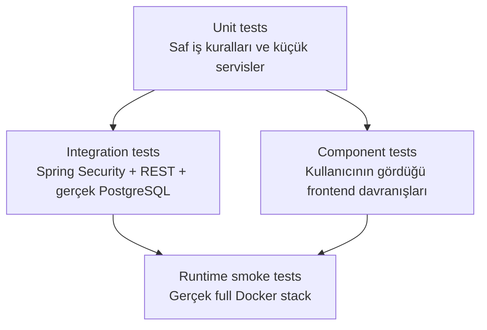

# Test Stratejisi ve Kanıt Raporu

Bu belge, çözümün hangi risklere karşı nasıl doğrulandığını gösterir. Test sayısını tek başına kalite
kanıtı olarak görmüyorum; önemli olan testlerin case'in kritik failure mode'larını kapsamasıdır.

## Son Doğrulama Özeti

| Kontrol | Sonuç |
|---|---|
| Backend testleri | 31 test başarılı |
| Mock servis testleri | 9 test başarılı |
| Frontend testleri | 8 test başarılı |
| Frontend lint | Başarılı |
| Frontend production build | Başarılı |
| `npm audit --audit-level=high` | 0 vulnerability |
| Full Docker image build | Backend, mock ve frontend başarılı |
| Full Docker runtime | PostgreSQL, mock, backend ve frontend başarılı |
| Docker runtime smoke test | Backend health `UP`, mock `200`, frontend `200`, nginx üzerinden login başarılı |
| OpenAPI sözleşmesi | Public doküman, JWT bearer şeması ve `page/size/sort` parametreleri doğrulandı |
| GitHub Actions | [CI workflow başarılı](https://github.com/dselimozcelik/lab-results-smart-assistant/actions/workflows/ci.yml) |

Test sayıları son dokümantasyon doğrulamasında komut çıktısından alınmıştır.

## Test Stratejisi



### Unit testler

En hızlı katmandır. Anomaly hesabı, ingestion kararları, duplicate davranışı, audit detayları ve LLM
çıktı kontrolü küçük sınıflar üzerinde doğrulanır.

### Integration testler

Backend'in gerçek Spring context'i ve Spring Security zinciri çalıştırılır. PostgreSQL, Testcontainers
ile gerçek engine olarak başlatılır. Böylece Flyway migration'ları, unique constraint'ler ve PostgreSQL'e
özgü sorgular H2 gibi farklı bir veritabanında taklit edilmez.

### Dış servis testleri

Mock cihaz ve Ollama, backend testlerinde gerçek olarak çalıştırılmaz. MockWebServer kontrollü HTTP
cevabı, gecikme ve bozuk payload üretir. Bu sayede CI'ın Ollama/model indirmesine ihtiyacı yoktur.

### Frontend component testleri

Testing Library ile implementasyon detayından çok kullanıcının gördüğü davranış test edilir: login
butonu, hata mesajı, arama önerileri, kritik badge, detay navigasyonu ve AI loading/error/success
durumları.

### Runtime smoke test

Testlerden ayrı olarak full Docker stack gerçek image'lardan başlatıldı. Bu kontrol; Dockerfile,
compose network, Flyway, nginx proxy ve login akışının birlikte çalıştığını doğrular.

## Failure-Mode Matrisi

| Senaryo | Beklenen davranış | Otomatik kanıt | Görsel / operasyonel kanıt |
|---|---|---|---|
| Normal veri | Tüp ve testler saklanır, `NORMAL` hesaplanır | [`AnomalyClassifierTest`](../backend-api/src/test/java/com/hospital/backend/labresult/AnomalyClassifierTest.java), [`DeviceResultFactoryTest`](../mock-lab-service/src/test/java/com/hospital/mocklab/DeviceResultFactoryTest.java) | [Tüp detay](screenshots/04-patient-tube-detail.png) |
| Kritik veri | `CRITICAL` hesaplanır ve UI'da görünür | [`AnomalyClassifierTest`](../backend-api/src/test/java/com/hospital/backend/labresult/AnomalyClassifierTest.java), [`StatusBadge.test`](../frontend/src/components/StatusBadge.test.tsx) | [Kritik liste](screenshots/03-critical-patient-list.png) |
| Missing field/değer | Güvenilir tüpte test `INVALID` saklanır, audit sebebi içerir | [`BackendApiIntegrationTest`](../backend-api/src/test/java/com/hospital/backend/BackendApiIntegrationTest.java), [`LabResultIngestionServiceTest`](../backend-api/src/test/java/com/hospital/backend/labresult/LabResultIngestionServiceTest.java) | [Audit cevabı](screenshots/07-audit-log-response.png) |
| Invalid unit | Test `INVALID` saklanır | [`LabResultIngestionServiceTest`](../backend-api/src/test/java/com/hospital/backend/labresult/LabResultIngestionServiceTest.java), [`DeviceResultControllerTest`](../mock-lab-service/src/test/java/com/hospital/mocklab/DeviceResultControllerTest.java) | Audit API |
| Stale/future tüp | Bütün tüp reddedilir, sebep audit edilir | [`LabResultIngestionServiceTest`](../backend-api/src/test/java/com/hospital/backend/labresult/LabResultIngestionServiceTest.java) | Audit API |
| Duplicate tüp/test | Tekrar eklenmez, duplicate sayısı audit edilir | [`LabResultIngestionServiceTest`](../backend-api/src/test/java/com/hospital/backend/labresult/LabResultIngestionServiceTest.java) | Audit API |
| Device `503`/kesinti | Backend çökmez, failure audit edilir, sonraki cycle tekrar dener | [`LabResultPollerTest`](../backend-api/src/test/java/com/hospital/backend/labresult/LabResultPollerTest.java), [`DeviceResultControllerTest`](../mock-lab-service/src/test/java/com/hospital/mocklab/DeviceResultControllerTest.java) | Mock `device-error` curl cevabı |
| Device timeout | İstek yapılandırılan sürede kesilir | [`DeviceClientTest`](../backend-api/src/test/java/com/hospital/backend/labresult/DeviceClientTest.java) | Polling logu |
| Ollama timeout/kesinti | Kontrollü AI failure; analiz kaydı yazılmaz | [`AiAnalysisServiceTest`](../backend-api/src/test/java/com/hospital/backend/ai/AiAnalysisServiceTest.java) | Frontend AI error state |
| Malformed/boş LLM JSON | Çıktı reddedilir, cache'e yazılmaz | [`AiAnalysisServiceTest`](../backend-api/src/test/java/com/hospital/backend/ai/AiAnalysisServiceTest.java) | API `503 ProblemDetail` |
| LLM sahte flagged test üretir | Model iddiası yok sayılır; backend durumları kullanılır | [`AiAnalysisServiceTest`](../backend-api/src/test/java/com/hospital/backend/ai/AiAnalysisServiceTest.java) | [AI ekranı](screenshots/05-ai-analysis.png) |
| Yetkisiz erişim | Korumalı endpoint `401 ProblemDetail` döndürür | [`BackendApiIntegrationTest`](../backend-api/src/test/java/com/hospital/backend/BackendApiIntegrationTest.java) | Login akışı |
| Hatalı login | Kullanıcı varlığı sızdırılmadan `401` ve açık UI mesajı | [`LoginPage.test`](../frontend/src/pages/LoginPage.test.tsx), [`GlobalExceptionHandlerTest`](../backend-api/src/test/java/com/hospital/backend/common/GlobalExceptionHandlerTest.java) | [Login ekranı](screenshots/01-login.png) |
| Geçersiz enum/tarih | `500` yerine tutarlı `400 ProblemDetail` | [`BackendApiIntegrationTest`](../backend-api/src/test/java/com/hospital/backend/BackendApiIntegrationTest.java) | Swagger/API |
| Aşırı page size | Backend maksimum `100` ile sınırlar | [`BackendApiIntegrationTest`](../backend-api/src/test/java/com/hospital/backend/BackendApiIntegrationTest.java) | API response |
| Swagger'da korumalı endpoint çağrısı | Bearer JWT girilir; audit ve hasta endpoint'leri çalıştırılabilir | [`BackendApiIntegrationTest`](../backend-api/src/test/java/com/hospital/backend/BackendApiIntegrationTest.java), [`OpenApiConfig`](../backend-api/src/main/java/com/hospital/backend/common/OpenApiConfig.java) | [Audit cevabı](screenshots/07-audit-log-response.png) |
| Swagger pagination sözleşmesi | `Pageable`, tek JSON nesnesi yerine `page`, `size`, `sort` query parametreleri olarak sunulur | [`BackendApiIntegrationTest`](../backend-api/src/test/java/com/hospital/backend/BackendApiIntegrationTest.java) | [Audit cevabı](screenshots/07-audit-log-response.png) |
| Arama sırasında her tuşta liste sorgusu | Öneriler debounce ile gelir, liste açıkça apply edilince değişir | [`PatientSearchBar.test`](../frontend/src/components/PatientSearchBar.test.tsx) | [Arama önerileri](screenshots/02-patient-search-suggestions.png) |
| AI frontend durumları | Loading, success ve error görünür | [`AiAnalysisPanel.test`](../frontend/src/components/AiAnalysisPanel.test.tsx) | [AI ekranı](screenshots/05-ai-analysis.png) |

## Test Dosyalarının Sorumlulukları

### Backend

| Test | Doğruladığı alan |
|---|---|
| `AnomalyClassifierTest` | NORMAL/LOW/HIGH/CRITICAL/INVALID sınırları |
| `LabResultIngestionServiceTest` | Validation, duplicate ve audit kararları |
| `LabResultPollerTest` | Empty batch ve cihaz hatası davranışı |
| `DeviceClientTest` | Device HTTP timeout |
| `AiAnalysisServiceTest` | Prompt, cache, malformed output, sahte flagged test ve timeout |
| `PollingAuditServiceTest` | Başarılı/başarısız audit detayları |
| `GlobalExceptionHandlerTest` | Tutarlı ProblemDetail cevapları |
| `PatientSummaryQueryTest` | Gerçek PostgreSQL üzerinde filtre ve rollup sorgusu |
| `SampleResponseTest` | Tüp worst-status önceliği |
| `BackendApiIntegrationTest` | Auth, korumalı endpoint, parametre validation, Flyway, audit ve OpenAPI sözleşmesi |

### Mock servis

| Test | Doğruladığı alan |
|---|---|
| `DeviceResultFactoryTest` | Bütün kontrollü senaryolar ve reproducible random batch |
| `DeviceResultControllerTest` | HTTP status ve endpoint davranışı |

### Frontend

| Test | Doğruladığı alan |
|---|---|
| `LoginPage.test` | Eksik form ve hatalı login UX'i |
| `PatientsPage.test` | Liste, kritik durum ve detay navigasyonu |
| `PatientSearchBar.test` | Case-insensitive öneri ve kontrollü apply |
| `StatusBadge.test` | Kritik durumun metin + stil ile iletilmesi |
| `AiAnalysisPanel.test` | Loading, başarı, disclaimer ve hata |

## Doğrulama Komutları

Backend:

```bash
cd backend-api
./mvnw test
```

Mock servis:

```bash
cd mock-lab-service
./mvnw test
```

Frontend:

```bash
cd frontend
npm ci
npm test
npm run lint
npm run build
npm audit --audit-level=high
```

Docker ve compose:

```bash
docker compose config --quiet
docker compose -f docker-compose.full.yml config --quiet
docker compose -f docker-compose.full.yml build
docker compose -f docker-compose.full.yml up
```

Smoke test:

```bash
curl http://localhost:8080/actuator/health
curl 'http://localhost:8081/api/device-results/batch?scenario=critical'
curl -I http://localhost:5173
```

## CI Kalite Kapısı

GitHub Actions workflow üç bağımsız job çalıştırır:

- Backend: Java 17 + Maven testleri; Testcontainers GitHub runner Docker'ını kullanır.
- Mock servis: Maven testleri.
- Frontend: `npm ci`, test, lint ve production build.

Workflow: [`.github/workflows/ci.yml`](../.github/workflows/ci.yml)  
Sonuçlar: [GitHub Actions](https://github.com/dselimozcelik/lab-results-smart-assistant/actions/workflows/ci.yml)

## Kalan Riskler

- Component testleri gerçek browser E2E testinin bütün davranışlarını kapsamaz. Bu case'te runtime
  smoke test ve manuel ekran doğrulamasıyla desteklendi; production'da Playwright/Cypress E2E eklenir.
- LLM kalite testi deterministik şema/güvenlik sınırlarını doğrular; klinik doğruluk değerlendirmesi
  alan uzmanı ve version'lı evaluation dataset gerektirir.
- Multi-instance ingestion yarışı single-node demo kapsamında test edilmedi.
